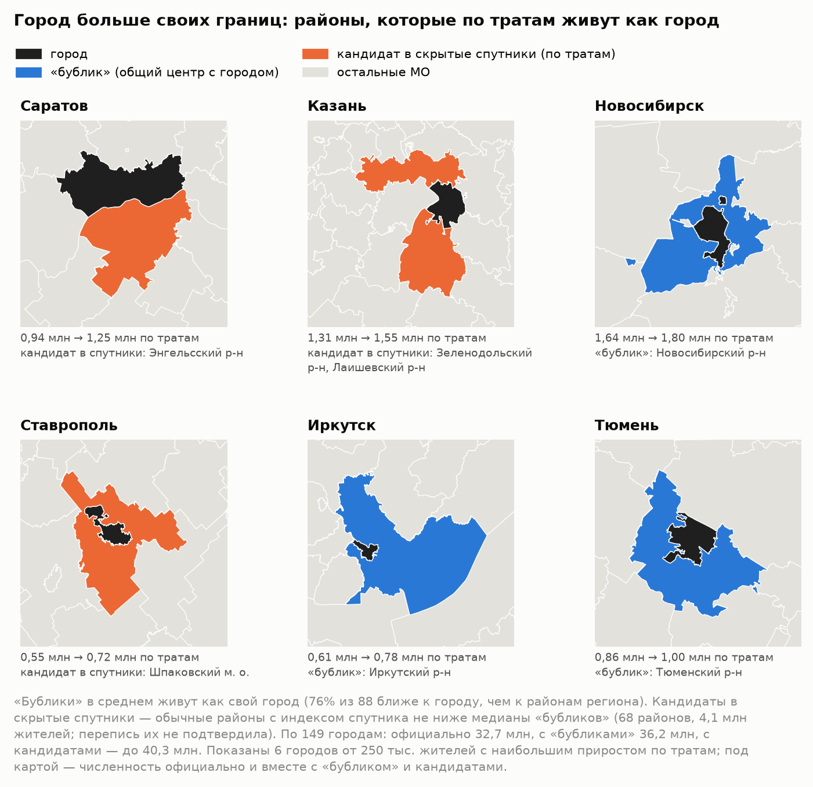
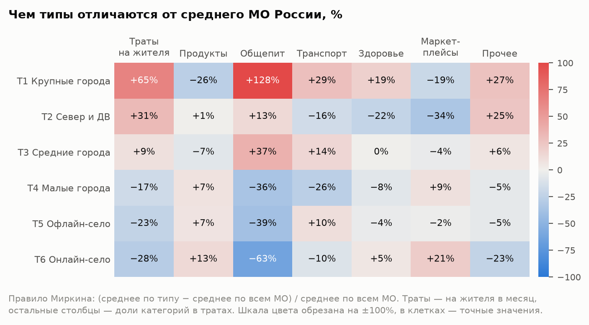
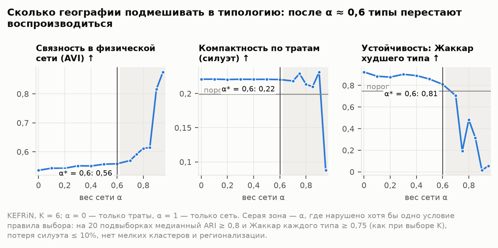
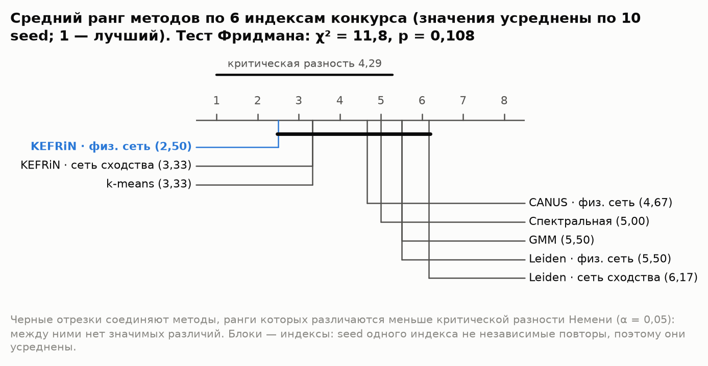
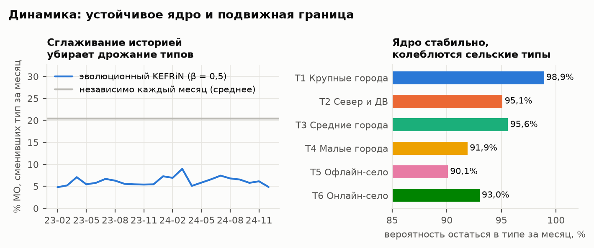
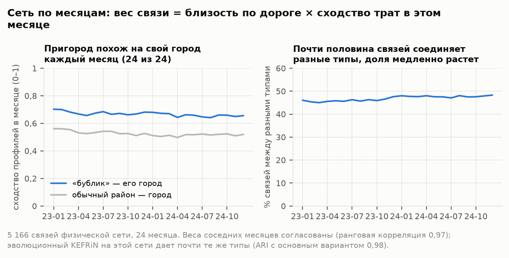
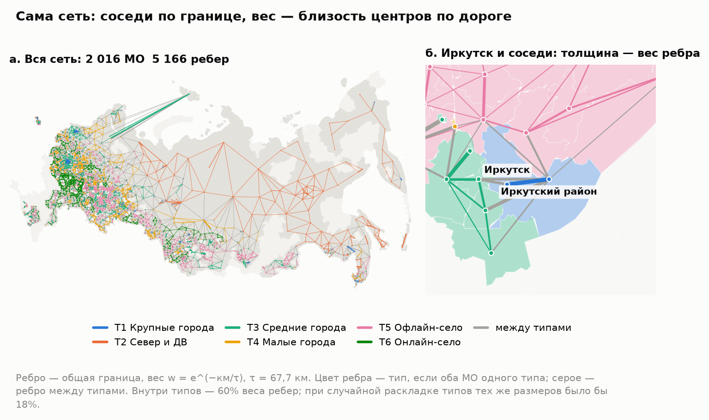

# Город больше своих границ

Типы локальных экономик России по тратам жителей: динамическая атрибутированная сеть муниципальных образований.
Методологический отчет. Онлайн-конкурс СберИндекса 2026, номинация «Кластеризация». Автор: Дмитрий Юшков.

*Как читать.* Первые страницы — резюме всей работы: «Коротко», метод в шести шагах и ответы на три вопроса конкурса.
Краткая версия отчета на нескольких страницах — `report_short.pdf` рядом с этим файлом и на лендинге.
Дальше каждый раздел начинается с плашки «Главное». Термины объяснены в глоссарии в конце, детали проверок — в приложениях. Интерактивная версия с картой всех МО — на лендинге: <https://demondevils666.github.io/research-2026/>. Код, конфиги и инструкция
по запуску — <https://github.com/demondevils666/research-2026>.

> **Коротко.**
> - **Что построено.** Сеть из 2 016 муниципальных образований (МО). Узел описан структурой и уровнем трат
>   жителей по данным СберИндекса за 24 месяца. Ребро соединяет соседей по границе, и вес ребра тем больше, чем
>   ближе их центры по дороге. Совместная кластеризация признаков и сети (KEFRiN) выделяет **6 типов местных
>   экономик**; число типов и вес сети выбраны согласованно, по воспроизводимости на подвыборках.
> - **Главная находка: город больше своих границ.** Ее можно проследить в три шага.
>   1. *Факт.* У 76% районов вокруг городов с общим административным центром («бубликов») профиль трат ближе
>      к своему городу, чем к районам своего региона (88 пар); у обычных соседних районов —
>      у 51%. При этом по Росстату 89% жителей «бубликов» — сельское население.
>      Сильнее всего это у столиц регионов: 20 «бубликов» из 20 против 42% у обычных соседей.
>      У остальных городов различие по профилю меньше и статистически незначимо (66% против 55%;
>      разбивка — по 64 парам полной панели),
>      но по переписи и оттуда чаще ездят на работу в другой населенный пункт (раздел 2.1).
>   2. *Механизм.* Росстат считает зарплату по месту работы (по организациям на территории МО), а СберИндекс траты —
>      по месту жительства. Если житель района работает в городе, его зарплата попадает в статистику города, а траты —
>      в статистику района. Перепись 2010 года это подтверждает: в «бубликах» доля работающих в другом населенном
>      пункте на 25,7 п. п. выше, чем у типичного района своего региона, у обычных соседей города — на
>      7,7 п. п. (20 регионов).
>   3. *Следствие.* Официальная статистика не видит пригородную экономику: по типу населенного пункта «бублики» — село,
>      а зарплата их жителей засчитывается городу, где они работают. Во всех 146 «бубликах» живут 5,7 млн человек. Реальные города больше официальных:
>      у 149 городов, где у пригорода есть данные о тратах, официально 32,7 млн жителей, а вместе с
>      «бубликами» — 36,2 млн. Для оценки благосостояния, программ поддержки и планирования агломераций
>      нужен взгляд по месту жительства — его дают траты.
> - **С отчетом лаборатории СберИндекса это согласуется.** Все 4 пригорода Дальнего Востока, которые она
>   назвала в своем отчете, попали в наши «городские» типы (T1, T3). Районов всего 4, и у 2 из них
>   города нет в данных, поэтому это сверка, а не строгая проверка.
> - **Вывод о методе.** Тип территории задает поведение жителей, а не соседство: при выбранном весе сети
>   α = 0,6 разбиение почти совпадает с разбиением только по тратам (ARI 0,97): сеть передвинула
>   лишь 28 МО из 2 016 — пограничных, а если вес сети в KEFRiN больше 0,6, типы перестают воспроизводиться. Это вывод для нашей постановки —
>   KEFRiN, сеть соседства, 6 типов на всю страну.

## Метод в шести шагах

| Шаг | Что делаем | Раздел |
|---|---|---|
| 1. Данные | 2 016 МО × 24 месяца безналичных трат жителей по шести категориям (СберИндекс). Росстат, перепись 2010 года и отчеты лаборатории в расчет типов не входят — ими типы только проверяются | 1.1 |
| 2. Признаки | CLR шести долей + ln(траты) − медиана месяца: структура трат и уровень относительно страны в том же месяце (без инфляции и сезона) | 1.2 |
| 3. Сеть | w = общая граница × e^(−км/τ), τ = 67,7 км: соседи по границе, чем ближе центры по дороге, тем сильнее связь; сеть не зависит от трат. Еще пять правил ребра — для сравнения | 1.3, 4.3 |
| 4. KEFRiN | Совместная кластеризация трат и сети: K = 6 — по воспроизводимости на подвыборках, вес сети α = 0,6 — той же проверкой | 4, прил. Б |
| 5. Динамика | Эволюционный KEFRiN по месяцам (β = 0,5) и схема MONIC: смены типа у МО, судьба типов целиком, содержание типов | 6 |
| 6. Качество и проверка | Шесть индексов конкурса, сравнение 8 методов на 10 seed, устойчивость, проверка Росстатом, переписью 2010 года и отчетом лаборатории | 3, 5, 8 |

## Три вопроса конкурса — короткие ответы

| Вопрос | Короткий ответ | Подробно |
|---|---|---|
| Что именно найдено? | Шесть типов местных экономик — от крупных городов до аграрных районов, где доля маркетплейсов выше всего. Пригороды тратят как свой город, хотя статистика считает их селом. Поведение важнее географии: сеть почти не меняет типы и не создает их. | разделы 2–4 |
| Почему этому можно доверять? | Проверка данными, которые в расчет не входили: Росстат и перепись 2010 года; с ними согласуется отчет лаборатории. Тип сравниваем с простой базой — группами по одному уровню трат. Отрицательные результаты показаны: налоговый след пригородов, скрытые спутники по переписи, незначимые различия методов. Прогон воспроизводится байт в байт. | разделы 2, 3.2, 5.4, 8, 11 |
| Как это использовать дальше? | Сверять зарплату Росстата с тратами СберИндекса, чтобы не принять пригород за бедное село; сравнивать МО с похожими из других регионов («двойниками»): искать у них применимый опыт и сравнивать рост трат. | раздел 9 |


*Рис. 1. Пример главной находки: Иркутский район по данным Росстата, СберИндекса и переписи 2010 года.
По тратам район относится к тому же типу, что и его город (T1).*

**Содержание.** 1. Данные, признаки, сеть · 2. Главная находка: город больше своих границ · 3. Шесть типов местных
экономик · 4. Сколько географии нужно типологии · 5. Методы и ICVI · 6. Динамика · 7. Пространство · 8. Надежность ·
9. Применение · 10. Ограничения · 11. Воспроизводимость · Приложения · Литература · Глоссарий

## 1. Данные, признаки, сеть

> **Главное.** Типы строим только по тратам СберИндекса: 2 016 МО, 24 месяца, 7 признаков (структура и
> уровень трат). Сеть строим только по географии: общая граница и расстояние по дороге между центрами. Сеть не повторяет
> признаки, поэтому можно проверить, совпадают ли поведение и география. Росстат, перепись и работы лаборатории в расчет
> не входят: ими типы только проверяются.

### 1.1. Данные

| Источник | Что берем | Роль |
|---|---|---|
| СберИндекс: потребительские безналичные расходы по МО (архив хакатона) | оценка средних трат жителя по 5 категориям и в целом, руб./мес., 2 190 МО, 2023-01 … 2024-12 | **признаки** |
| СберИндекс: справочник границ и преобразований МО | тип МО, центр, границы, пары «город + окружающий район» | **сеть** и группы сравнения |
| СберИндекс: автодорожные расстояния между МО | км по дороге между центрами | **вес ребра** |
| СберИндекс: индекс доступности рынков, индекс покупательской мобильности | показатели МО | только внешняя проверка |
| Росстат, БД ПМО (выгрузка «Если быть точным») | население, зарплата, занятость по ОКВЭД2, торговые площади и оборот розницы, НДФЛ в доходах местных бюджетов | только внешняя проверка |
| Всероссийская перепись населения 2010 года, региональные издания, том 7 | занятые по территории нахождения работы, по городским округам и районам, 20 регионов | только внешняя проверка |

- **Панель.** Берем МО, у которых все 24 месяца есть во всех категориях: **2 016 МО**,
  48 384 строки.
- **Что выпало.** У 174 МО ряды неполные, и
  12 регионов в полной панели нет совсем. Из них 8 в данных СберИндекса отсутствуют
  целиком — ни в архиве хакатона, ни в API нет ни одного их МО: Белгородская область, Брянская область, Воронежская область, Краснодарский край, Курская область, Республика Крым, Ростовская область, Севастополь. В остальных
  (Республика Бурятия, Республика Дагестан, Республика Ингушетия, Чеченская Республика) есть только МО с неполными рядами. Что с ними делаем — приложение Г.
- **Росстат и МО.** Данные Росстата за 2023 год сопоставлены с МО по ОКТМО в версии справочника, действовавшей
  в год наблюдения.
  Покрытие по населению и зарплате — 100% МО панели.
- **Санити-проверки.** Пропусков, нулей и дублей ключа нет. Доли категорий в сумме дают 1 с точностью до машинной
  погрешности. «Прочее» (итог минус пять категорий) нигде не отрицательное.
- **Лицензии.** Данные СберИндекса — CC BY-SA 4.0, данные Росстата в обработке «Если быть точным» — CC BY 4.0.
  Производные данные этой работы распространяются по CC BY-SA 4.0. Полные ссылки на наборы — в разделе «Литература».

### 1.2. Признаки: что описывает муниципалитет

Используем только траты СберИндекса. Росстат в кластеризацию не входит: так видно, что именно говорят о территории
данные о тратах, а официальная статистика остается независимой проверкой.

**Какие показатели рассматривали.** Условие предлагает несколько наборов данных. В признаки вошли только траты,
остальные показатели служат независимой проверкой.

| Показатель | Роль | Почему |
|---|---|---|
| Траты жителей по категориям (СберИндекс) | **признаки** | есть помесячно у всех 2 016 МО панели — это нужно для динамической сети; описывают жителей по месту жительства |
| Индекс доступности рынков (СберИндекс) | проверка | по сути свертка той же дорожной матрицы с населением: в признаках он дублировал бы сеть; один год; есть у 2 004 МО панели из 2 016 |
| Покупательская мобильность (СберИндекс) | проверка | есть у 270 МО панели, почти только на Северо-Западе; один год |
| Зарплата и занятость по отраслям (Росстат) | проверка | годовые и по месту работы — именно этот взгляд мы сравниваем с тратами; в признаках они сделали бы проверку раздела 3.2 круговой |
| Население и доля горожан (Росстат) | проверка | сделали бы типы классами по размеру и «городскости»; оставлены для интерпретации |

1. **Структура трат** — доли шести категорий: продукты, здоровье, маркетплейсы, общепит, транспорт, «прочее».
   Доли в сумме дают единицу (композиционные данные), поэтому переводим их в CLR-координаты Айчисона:
   `clr_j = ln(доля_j) − среднее ln(долей)`. Без этого рост одной доли автоматически «уменьшает» остальные и искажает
   расстояния.
2. **Относительный уровень трат** — `ln(траты на жителя) − медиана ln по всем МО в этом месяце`. Вычитание медианы
   месяца снимает инфляцию и общую сезонность. Остается положение МО относительно страны.

- **Годовой профиль МО** (2024): CLR средних за год долей и средний относительный уровень,
  всего 7 признаков, каждый стандартизован (z-оценка).
- **Для динамики** те же признаки считаются по каждому месяцу и стандартизуются внутри месяца. Смена типа тогда означает
  движение МО относительно других, а не общую сезонность или общую волну маркетплейсов.

### 1.3. Сеть: как появляется ребро

`w_ij = 1[у МО i и j общая граница] · exp(−d_ij / τ)`

- d — расстояние по дороге между центрами МО, τ = 67,7 км (медиана по соседним парам).
  Сама сеть на карте — рис. 12 в разделе 7.
- Если дорожного расстояния нет, берем расстояние по прямой × 1,27. Это медианная извилистость
  дорог в данных.
- У пары «город + окружающий район» центр общий, поэтому d = 0 и вес ребра максимальный (1).
- 42 МО без соседей в панели связаны с тремя ближайшими по дороге.
- Сеть (5 166 ребер) состоит из 6 несвязанных кусков: основной — 1 917 МО, малые —
  Ставропольский край и соседи (53), Калининградская область (19), Камчатский край и соседи (16), Республика Адыгея (9), Сахалинская область (2). Их отделяют
  регионы и МО, которых нет в полной панели, или море. KEFRiN это не мешает: у каждого МО есть и признаки. А метод только
  по сети выделяет каждый малый кусок отдельно (Leiden, раздел 5.2).
**Экономический смысл.** Чем ближе соседи по дороге, тем больше между ними поездок на работу и за покупками
(гравитационная модель). Та же логика лежит в индексе доступности рынков СберИндекса.

**Почему не сходство трат.** Такая сеть **не зависит от признаков**. Если строить ребра из тех же трат, атрибуты и сеть
становятся двумя взглядами на одно и то же. Независимая сеть позволяет задать содержательный вопрос: совпадают ли
поведение и география? Пять других правил ребра, включая сходство трат, сравниваются в разделе 4.3.

**Сеть по месяцам.** Условие требует сеть для каждого месяца. Узлы и ребра берем из физической сети, а вес ребра
в месяце t умножаем на сходство соседей в этом месяце:
`W_t(i, j) = w_ij · exp(−‖x_i(t) − x_j(t)‖² / 2h²)`, h = 1,86 (медиана расстояний по ребрам за все месяцы).
Получается последовательность G_t = (V, E, W_t, X_t): топология постоянна (дороги и границы не меняются по месяцам),
а вес ребер и атрибуты меняются. Что она показывает — в разделе 6.

## 2. Главная находка: город больше своих границ

> **Главное.** У «бубликов» — районов вокруг города с общим центром — профиль трат ближе к своему городу, чем к районам
> своего региона: так у 76% из 88 пар, у обычных соседних районов — у 51%. Сильнее всего это у столиц регионов; у остальных
> городов различие по профилю незначимо (раздел 2.1). Причина в том, что зарплату считают по
> месту работы, а траты — по месту жительства. Перепись 2010 года это подтверждает для «бубликов»
> (+25,7 против +7,7 п. п. у обычных соседей), но не для кандидатов в скрытые спутники
> (p = 0,716). Налоговый след в местных бюджетах не найден (раздел 2.5).

### 2.1. «Бублики» по тратам ближе к своему городу

**«Бублик»** — район вокруг города, у которого общий с городом административный центр (Томский район вокруг Томска,
Хабаровский вокруг Хабаровска). Такие пары отмечены в справочнике СберИндекса, всего их 146.

**Контроль** — обычные районы, которые тоже граничат с городским округом своего региона (если таких городов несколько,
берется ближайший по дороге). Если «бублик» похож на город только потому, что граничит с ним, контроль покажет то же самое.
Город другого региона в контроль не берем: район сравнивается с районами своего региона, и чужой город занизил бы
близость сам по себе.

Число пар зависит от проверки: у одних МО нет всех месяцев данных, у других в регионе мало обычных районов для сравнения.

| Выборка | «Бублики» | Контроль | Где используется |
|---|---|---|---|
| Все пары справочника СберИндекса | 146 | — | масштаб: 5,7 млн жителей |
| Есть данные о тратах (полная панель или у обоих МО ≥ 12 мес.) | 90 | — | функциональные города (раздел 2.3) |
| Профиль трат, все пары с данными | 88 | 283 | основная цифра: 76% против 51% |
| Полная панель (24 мес.) | 65 | 286 | синхронность и зарплата (таблица ниже) |
| Профиль в полной панели (в регионе не меньше трех обычных районов) | 64 | 283 | таблица ниже, рис. 2, разбивка по столицам (20 + 44) |
| Перепись 2010 года (есть данные о поездках) | 40 | 64 | механизм (раздел 2.2) |
| Контроль с городами других регионов | — | 351 | чувствительность |

| Измерение | «Бублик» — свой город | Обычный район — соседний город | Тест | Что это значит |
|---|---|---|---|---|
| Профиль трат ближе к своему городу, чем к районам своего региона (64 пары) | **77%** (ДИ 66–86%) | 51% (ДИ 45–57%) | p = 0,002 | тратит как свой город, а не как сельские соседи |
| Синхронность помесячных изменений трат (средняя корреляция) | **0,51** (ДИ 0,43–0,59) | 0,30 (ДИ 0,26–0,34); район — чужой город: 0,16 | p < 0,001 | траты движутся вместе с городом |
| Траты идут за местной зарплатой Росстата? (корреляция отношений район/город по тратам и по зарплате) | **−0,24** (ДИ от −0,45 до 0,01): связи нет | 0,48 (ДИ 0,38–0,56) | p < 0,001 | у обычного района выше зарплата — выше и траты; у «бублика» связи нет: зарплату его жителям платят в городе |

p-значения в таблице — перестановочные тесты, где каждая пара — отдельное наблюдение. Пары с общим городом не независимы,
поэтому p — ориентир, а не точный уровень (раздел 10, п. 13).

- **Проверка на всех парах с данными.** Добавили 25 пар вне полной панели (у обоих МО
  не меньше 12 месяцев данных); профиль удалось посчитать у 24 из них. Всего
  88 пар (64 в полной панели и 24 добавленных) — это основная цифра отчета:
  - профиль ближе к своему городу у 76% (ДИ 67–84%)
    против 51% у контроля;
  - средняя корреляция с городом 0,48 против 0,30;
  - оба различия значимы (p < 0,001).
- **Эффект держится в основном на столицах регионов.** Около столиц профиль ближе к своему городу у
  20 «бубликов» из 20 против 42% у обычных соседей (76 пар контроля,
  p < 0,001). Около остальных городов — у 66% из 44 «бубликов» против 55% (207 пар контроля):
  различие меньше и статистически незначимо (p = 0,180). Разбивка сделана на 64 парах полной панели
  (на них «ближе к городу» — 77%); основная цифра 76% посчитана на всех 88 парах с данными.
  Механизм виден и у нестоличных городов: по переписи 2010 года из их «бубликов» ездят на работу в другой
  населенный пункт на 15,3 п. п. чаще, чем из обычных соседей (30 и 48 МО,
  p < 0,001). У столиц разница больше (26,4 п. п.), но пар мало (10 и
  16), и тест незначим (p = 0,124). Этот разрез разведочный, заранее он не задавался.
- **Сеть со-движения тоже это видит.** Если связать каждый МО с 8 самыми синхронными по помесячным изменениям трат, пара
  «бублик — его город» окажется связанной в 29% случаев, а обычный район и соседний город —
  в 15%.
- **Масштаб.** В 146 «бубликах» живет **5,7 млн
  человек**, по Росстату 89% из них сельские жители. Для статистики
  это село, а по тратам — город.
- **Уровни: Иркутск — крайний случай, а не правило.** Медианная зарплата Росстата у «бубликов» — 93% от
  городской, траты — 88% (у обычных соседей — 88% и
  85%). Зарплата ниже 80% городской лишь у 22% «бубликов»; траты выше
  зарплаты (в % к городу) у 43%, а на 20 п. п. и больше, как у Иркутского района, — у
  11%. Сравнивать эти уровни напрямую нельзя: зарплата Росстата — это зарплата тех, кто работает в районе,
  а не доход тех, кто в нем живет. Поэтому общее для всех «бубликов» не разрыв уровней, как у Иркутского района на рис. 1, а три меры
  таблицы: структура трат, синхронность и независимость трат от местной зарплаты.
- **Контроль с городами других регионов.** Если брать в контроль и районы, граничащие только с городом другого
  региона, «ближе к городу» у контроля — 48%
  (351 пара) вместо
  51%: такие пары занижают контроль, поэтому в основном расчете их нет.


*Рис. 2. Три независимых измерения: «бублик» против обычного соседнего района (полная панель: 64 пары для профиля,
65 — для синхронности и зарплаты; основная цифра на всех 88 парах — 76%).*

### 2.2. Механизм: место работы против места жительства, проверка переписью 2010 года

Три источника считают разное.
- **Зарплата Росстата** — «среднемесячная заработная плата работников организаций (без субъектов малого
  предпринимательства)». Ее считают по организациям, которые находятся на территории МО, то есть по месту работы.
  Житель района, который работает у городского работодателя, попадает в среднюю зарплату города, а средняя по району
  складывается только из районных работодателей.
- **Траты СберИндекса** — оценка безналичных трат жителей МО, то есть по месту жительства: лаборатория моделирует
  «домашнюю локацию клиента на основе транзакционных паттернов». Траты относятся к жителям МО, а не к магазинам на
  его территории.
- **«Сельское население»** у Росстата — тип населенного пункта, а не образ жизни: городскими считаются населенные
  пункты, утвержденные как города и поселки городского типа, остальные — сельскими (методологические пояснения
  Росстата). Район без городов «сельский», даже если его жители работают в соседнем городе.

Если жители «бублика» работают в городе, местная зарплата их не описывает, а траты описывают. С этим согласуются все
три меры раздела 2.1.

**Прямая проверка.** Данных о поездках на работу у СберИндекса нет, их дает перепись. В региональных изданиях
Всероссийской переписи населения 2010 года (том 7) есть таблица «Занятое в экономике население… по территории
нахождения работы» по каждому городскому округу и району. Мера — доля занятых, которые работают в другом
населенном пункте своего региона. Она учитывает и поездки в соседнее село или свой райцентр, а ее уровень сильно
различается по регионам (медиана районов — от 3,5% до
40,8%). Поэтому сравниваем с типичным районом своего региона: отклонение от медианы его районов.

**Почему перепись 2010 года, а не свежие данные.** Это последняя перепись, в которой таблица «по территории нахождения
работы» опубликована по районам и городским округам. В итогах переписи 2020 года (том 10 «Рабочая сила», таблицы 9–11)
место работы дано по России и субъектам; региональные издания с разбивкой по районам найти не удалось. Разрыв в 13–14 лет
делает проверку консервативной, а не бесполезной:
- то, что район — пригород своего города, меняется медленно: «бублики» и тогда, и сейчас окружают тот же центр;
- после 2010 года пригороды выигрывали во внутрирегиональной миграции (Карачурина, Мкртчян 2021), а в наших данных
  «бублики» теряют население медленнее обычных районов (раздел 2.3), поэтому доля работающих вне своего поселка у них
  скорее выросла, чем упала;
- мы сравниваем группы внутри одного региона, а не уровни разных лет.

Слабое место — новые пригороды: районы, которые стали пригородами после 2010 года, перепись не увидит. Это может быть
одной из причин, почему не подтвердились скрытые спутники.

- **Охват:** 20 регионов (Иркутская область, Хабаровский край, Красноярский край, Республика Хакасия, Республика Тыва, Удмуртская Республика, Калининградская область, Псковская область, Свердловская область, Ивановская область, Костромская область, Кировская область, Самарская область, Республика Башкортостан, Владимирская область, Приморский край, Новгородская область, Ярославская область, Алтайский край, Кемеровская область); с нашими МО сопоставлено
  636 записей переписи по названиям.

| Группа | МО | Среднее отклонение, п. п. (95%-интервал) | Медиана отклонения, п. п. | Доля выше медианы региона |
|---|---|---|---|---|
| «Бублики» | 40 | +25,7 (21,3–30,3) | +25,8 | 93% |
| Скрытые спутники (найдены по тратам) | 22 | +6,6 (0,3–13,4) | +3,4 | 59% |
| Прочие соседи города (контроль) | 64 | +7,7 (4,6–10,6) | +6,6 | 69% |
| Остальные МО | 510 | −2,9 (от −3,7 до −2,1) | −2,8 | 32% |


*Рис. 3. Перепись 2010 года: насколько чаще, чем в типичном районе своего региона, жители групп МО работают в другом
населенном пункте (среднее отклонение, отрезок — 95%-интервал бутстрапа).*

- **«Бублики» против контроля: механизм подтвержден.** Разность средних отклонений 18,1 п. п., p < 0,001
  (40 «бубликов» и 64 обычных соседа; метки групп перемешиваются только внутри региона,
  10 000 перестановок). Вывод тот же, если считать всех, кто работает вне своего населенного пункта, включая другой регион
  (18,2 п. п.).
- **Скрытые спутники перепись не подтверждает.** Разность с контролем −1,1 п. п., p = 0,716: из спутников, найденных по тратам,
  в 2010 году ездили на работу не чаще, чем из обычных соседей города. Индекс спутника поездки не предсказывает: среди
  обычных соседей ранговая корреляция Спирмена индекса с отклонением доли −0,20 (p = 0,070, n = 86).
  Сходство спутников с городом по тратам не сводится к маятниковой миграции, поэтому мы называем их только кандидатами.
- **Разведочно** (этот разрез не был задан заранее): мера переписи по району «размывается», если в районе есть свой город,
  жители которого работают у себя. Среди районов, где горожан меньше половины, спутники ездят на работу чаще
  контроля (15,6 против 9,5 п. п., спутников 11), а среди районов со своим городом — нет
  (−2,5 против 3,3). Выборка мала, это гипотеза для проверки, а не вывод.
- **Промахи.** Ниже медианы своего региона 12 МО из «бубликов» и спутников, например
  Тернейский м. о. (5,8%), Таштагольский р-н (6,7%), Таймырский Долгано-Ненецкий р-н (2,1%), Угличский р-н (12,6%), Слободо-Туринский р-н (14,1%).
  Таймырский район похож на Норильск по тратам, но поездок на работу там почти нет: сходство дает северная
  экономика, а не маятниковая миграция.
- **Пропущенные пригороды.** На уровне «бубликов» ездят на работу из таких обычных соседей города:
  Беловский м. о. (52,3%, индекс −0,50), Надеждинский р-н (46,9%, индекс 0,28), Суздальский р-н (46,3%, индекс −0,28), Усть-Абаканский р-н (43,9%, индекс 0,41), город Славгород (34,0%, индекс 0,10).
  Их индекс спутника ниже порога.
  Надеждинский район лаборатория СберИндекса сама называет пригородом Владивостока (раздел 2.4), и перепись это
  подтверждает: индекс промахнулся.
- **Оговорки.** Перепись прошла в 2010 году, траты — 2023–2024 годов. Границы части МО с тех пор менялись,
  сопоставление идет по названиям. Регионы — те, где таблица опубликована по районам.

### 2.3. Скрытые спутники: кандидаты, которых нет в справочнике

**Индекс спутника** — среднее z-оценок трех мер раздела 2.1. У каждой знак «больше = больше похож на свой город»:
- близость профиля к городу по сравнению с районами своего региона;
- синхронность с городом сверх регионального фона;
- траты сверх того, что объясняет местная зарплата.

Состав индекса и порог зафиксированы до расчета.

| Мера | Насколько отличает «бублики» от обычных районов, AUC (95%-ДИ) |
|---|---|
| Индекс спутника | 0,69 (0,62–0,76) |
| Близость профиля | 0,73 (0,66–0,79) |
| Синхронность сверх фона | 0,70 (0,63–0,77) |
| Траты сверх зарплаты | 0,57 (0,49–0,64) |

AUC — вероятность, что случайный «бублик» получит индекс выше случайного обычного района (0,5 — не различает).
Заранее задан порог: если AUC индекса ниже 0,7, найденные районы подаются только как кандидаты.
Индекс порог не прошел (AUC 0,69).
Поэтому найденные районы мы называем только **кандидатами**.

Зарплатная мера на уровне отдельной пары слабая: эффект «место работы против места жительства» виден как связь в
группе, а не как метка района. Без нее AUC = 0,74, а список
спутников почти тот же: 45 из
48 совпадают.

**Скрытый спутник** — обычный район с индексом не ниже медианы «бубликов». Таких **68**
(24% обычных районов при городах), в них 4,1 млн жителей.
При более мягком пороге (нижняя квартиль «бубликов») их 137, при более
строгом (верхняя квартиль) — 11.

**Проверка мерами, которые в индекс не входили:**

| Мера | Скрытые спутники | Остальные обычные районы | Тест |
|---|---|---|---|
| Расстояние до города по дороге, км (медиана) | 30 | 52 | p < 0,001 |
| Изменение населения за 2023 г. (медиана) | −0,8% | −1,1% | p = 0,035 |
| Доля горожан (медиана) | 0,57 | 0,28 | p = 0,058 |
| Перепись 2010: отклонение доли работающих в другом населенном пункте, п. п. (среднее; раздел 2.2) | +6,6 | +7,7 | p = 0,716 |

- **Кто нашелся:**
  Энгельсский р-н (Саратов), Кстовский м. о. (Нижний Новгород), Елизовский р-н (Петропавловск-Камчатский), Завьяловский район (Ижевск), Медведевский р-н (Йошкар-Ола), город Нерехта и Нерехтский район (Волгореченск), Гурьевский м. о. (Калининград), Сосновский р-н (Челябинский г. о.), Шелеховский р-н (Ангарский г. о.), Березовский р-н (Сосновоборск).
  Среди них хрестоматийные пригороды и города-спутники.
- **Фактические «бублики», которых справочник не отметил.** У 3 районов центр лежит в городе
  или рядом, ближе 5 км: Зиминский р-н, Рязанский р-н, Предгорный м. о.
- **Литература подтверждает отдельные случаи.** Маятниковую миграцию из Емельяновского района в Красноярск ранее показали
  опросом (Дорофеева, Касьянова 2017). Наш метод нашел этот район по тратам, без опроса.
- **Пригороды теряют население медленнее.** За 2023 год «бублики» потеряли
  0,5% населения против 1,0% у обычных
  соседних районов (p = 0,002). Это согласуется с выводом Карачуриной
  и Мкртчяна (2021): во внутрирегиональной миграции пригороды выигрывают у региональных центров.

**Функциональные города** (рис. 4 в конце раздела 2.4). Берем 149 городов, где «бублик» или спутник проверен данными:
- официально в них 32,7 млн жителей;
- вместе с «бубликами» (3,5 млн) — **36,2 млн**:
  в сумму входят все «бублики» с данными о тратах, в том числе те 24%, чей профиль не ближе к своему городу;
  перепись подтверждает поездки на работу для «бубликов» в среднем, а не для каждого района;
- вместе с кандидатами в скрытые спутники (4,1 млн) — до **40,3 млн**. Это оценка
  сверху: перепись спутников не подтвердила (раздел 2.2). Суммы могут расходиться в последнем знаке
  из-за округления.

Обе суммы — бухгалтерская верхняя граница, а не функциональная городская зона в смысле ОЭСР (там район входит в зону,
если не меньше 15% его занятых ездят на работу в город): к городу прибавлено все население района, включая дальние села.


**Насколько точны эти числа.** Бутстрап месяцев дает 95%-интервалы:
- скрытых спутников 60–89;
- в них живет 3,8–4,7 млн человек;
- численность функциональных городов — 39,4–41,9 млн.

Интервалы отражают только шум по месяцам: что кандидаты в спутники не подтверждены, они не учитывают.

99% найденных спутников остаются спутниками больше чем в половине
повторов.

**Что с этим делает типология.** «Бублик» попадает в тот же тип, что его город, в
57% пар (у контроля 34%).
Например, Хабаровский, Иркутский, Новосибирский, Томский и Тюменский районы отнесены к «крупным городам» вместе
со своими городами.


### 2.4. Что видит сама лаборатория СберИндекса

- **Пригороды, которые назвала лаборатория.** В отчете о Дальнем Востоке (4.09.2025) лаборатория подписала
  6 районов как «пригород» своего центра. В нашей базе 4 из них, и все попали в «городские» типы
  T1 и T3: Надеждинский р-н — T3, Благовещенский м. о. — T1, Читинский р-н — T3, Хабаровский р-н — T1.
  Среди всех районов и муниципальных округов в этих типах лишь 15%, а среди городских округов —
  60%. Но районов всего 4, у 2 из них города нет в данных, а пригород
  крупного города попадает в «городской» тип и без нашего механизма. Поэтому это сверка с лабораторией, а не строгая
  проверка: биномиальный тест против доли всех районов (p < 0,001) значимость завышает.
  Надеждинский р-н наш индекс спутника не отметил: «его город» для пары — ближайший граничащий
  (Артемовский г. о.), а не центр агломерации. Это ограничение метода. По переписи 2010 года
  47% его занятых работали в другом населенном пункте — это пригород.
- **Механизм.** Лаборатория сама пишет, что строит траты по «домашней локации клиента», и предлагает прогнозировать
  «домашнюю и рабочую локации клиента (например, «домашний муниципалитет»)». В отчете «Дальний Восток в движении» (2026)
  она показывает, что жители Артёма тратят во Владивостоке пятую часть своих денег. Наш вклад — проверка механизма
  по всей стране, с контрольной группой и переписью.
- **Рост.** В типологии лаборатории «быстрорастущие пригороды агломераций» — кластер с самым быстрым ростом трат
  за первый квартал 2024 года к 2023-му (+12,5%). У нас за 2024 год «бублики» выросли на
  16,5% (медиана), обычные соседи города — на 13,9%
  (p < 0,001), скрытые спутники — на 18,1%. Но от своих городов «бублики» не
  отрываются: города выросли на 16,6% (парный тест Уилкоксона, p = 0,613). Пригороды растут вместе
  со своим городом.


*Рис. 4. Официальные и функциональные границы шести городов.*

### 2.5. Налоговый след: проверка, которая не подтвердилась

Налог на доходы физических лиц удерживает работодатель и перечисляет по месту своего учета (НК РФ, ст. 226, п. 7).
В местный бюджет зачисляется часть налога, «взимаемого» на его территории (БК РФ, ст. 61–61.6).
**Гипотеза:** если жители «бублика» работают в городе, их налог идет в бюджет города.

**Мера.** Разрыв = ln(траты район/город) − ln(НДФЛ местного бюджета на жителя район/город). Сравниваем
муниципальные районы с городскими округами, чтобы нормативы отчислений были одного вида.

**Данные.** Бюджеты — 2019 год, последний доковидный в БД ПМО; траты — 2023 год.
Пар: 45 «бубликов» и 168 обычных районов.

**Результат: эффекта нет.**
- Средний разрыв у «бубликов» −0,14, у обычных районов
  −0,09 (p = 0,736).
- Внутри регионов разрыв «бубликов» больше лишь в 55% из
  20 регионов
  (средняя разность −0,14, 95%-ДИ от −0,46 до 0,16; знаковый тест
  p = 0,824).

**Вероятные причины:** в пригородных районах тоже есть крупные работодатели (промзоны, логистика, аэропорты); в бюджет
района попадает только часть налога, плюс региональные дополнительные нормативы; бюджеты 2019 года на несколько лет
старше трат.

Поэтому механизм «место работы против места жительства» мы подтверждаем на зарплатах, тратах и переписи и **не
переносим на бюджеты**. Вопрос обсуждается в связи с предложениями зачислять НДФЛ по месту жительства (комитет
Госдумы по федеративному устройству, 2020; Минфин против, 2024). Наши данные эффект на уровне районов не показывают.

### 2.6. Где это уже видели

- **Карты как источник границ.** Регионы по сети карточных транзакций выделяли в Испании (Sobolevsky et al. 2014),
  города классифицировали по тратам жителей (Sobolevsky et al. 2016, PLoS ONE). BBVA вместе с CARTO перерисовали
  границы районов Мадрида по совместным покупкам и выделили шесть типов зон.
- **Тот же разрыв в официальной статистике других стран:**
  - Евростат: ВВП учитывается по месту работы, а доходы — по месту жительства, поэтому ВВП на душу завышен там, куда
    едут работать, и занижен там, откуда;
  - британская ONS публикует заработки и по месту работы, и по месту жительства;
  - американское BEA делает «поправку на место жительства».
- **Функциональные городские зоны ЕС–ОЭСР** (Dijkstra, Poelman, Veneri 2019) выделяют по поездкам на работу.
  Наши функциональные города — оценка по тратам, проверенная поездками из переписи там, где она есть.
- **Наш вклад:** профиль трат и физическая сеть для всех МО России; контрольная группа для пригородов; механизм
  «место работы против места жительства», проверенный переписью; кандидаты в пригороды, которых нет в справочнике.

**Зачем это нужно.** Агломерации и опорные населенные пункты — единицы политики в Стратегии пространственного развития
до 2030 года. Статистика по месту работы систематически «не видит» пригородную экономику. Траты дают независимый
и быстрый (ежемесячный) взгляд по месту жительства.

## 3. Шесть типов местных экономик

> **Главное.** Шесть типов — от крупных городов (T1: 296 МО, из них 227 — районы Москвы и Петербурга)
> до аграрных районов, где доля маркетплейсов выше всего (19,4% у T6). Типы проверены 10 показателями, которые в
> расчет не входили (8 Росстата и 2 индекса СберИндекса), против простой базы — столько же групп по одному уровню трат. Тип надежно сильнее базы по
> 4 показателям (население, занятость в добыче, занятость в рыночных услугах, доступность рынков), на уровне базы — по 4, слабее — по 2
> (зарплата, занятость в бюджетном секторе); среди показателей Росстата сильнее по 3 из 8 (раздел 3.2). Так и должно быть:
> уровень трат — почти доход, и доход он объясняет сам; тип добавляет размер, положение и отрасли. Каждый тип описывается правилом из 1–3 условий; средний F1 на отложенных МО —
> 0,79.

### 3.1. Кто есть кто

В таблице черты каждого типа даны по **правилу Миркина**: на сколько процентов среднее по типу отличается от среднего
по всем МО. Показаны три самых больших отклонения по тратам и два — по контексту Росстата (в расчет он не входил).

| Тип | МО | Жителей, млн | Траты, ₽/мес. (медиана) | Чем отличается от средней России | Контекст Росстата | Крупные МО |
|---|---|---|---|---|---|---|
| **T1 Крупные города** | 296 | 45,3 | 49 926 | общепит +128%, траты +65%, транспорт +29% | население +171%, рыночные услуги +104% | Новосибирск, Екатеринбург, Казань |
| **T2 Север и Дальний Восток** | 132 | 4,0 | 39 394 | маркетплейсы −34%, траты +31%, прочее +25% | добыча +429%, зарплата +63% | Якутск, Комсомольск-на-Амуре, Орск |
| **T3 Средние города и пригороды** | 400 | 40,4 | 32 723 | общепит +37%, транспорт +14%, траты +9% | население +79%, промышленность +68% | Волгоград, Саратов, Барнаул |
| **T4 Малые города и рабочие районы** | 437 | 10,4 | 24 850 | общепит −36%, транспорт −26%, траты −17% | население −58%, добыча −34% | Новотроицк, Грязинский р-н, Узловский р-н |
| **T5 Село с офлайн-корзиной** | 348 | 7,8 | 23 786 | общепит −39%, траты −23%, транспорт +10% | население −60%, занятость в с/х +54% | Изобильненский м. о., Михайловка, Кочубеевский м. о. |
| **T6 Аграрные районы, ушедшие в онлайн** | 403 | 5,9 | 21 861 | общепит −63%, траты −28%, прочее −23% | добыча −85%, население −74% | Пугачевский р-н, Ртищевский р-н, Каменский р-н |

**T1 — это прежде всего Москва и Петербург.** 227 из 296 МО типа — их внутригородские территории. Остальные
69 — крупные города и их пригороды по всей стране.

**Названия сравнительные.** «Офлайн-село» (T5) офлайн по сравнению с соседним сельским типом T6: доля
маркетплейсов 15,3% против 19,4%, хотя выше, чем у крупных городов (12,9%).

**Годовой тип и помесячный.** Тип в таблице — по годовому профилю 2024 года. У 10% МО он
не совпадает с самым частым помесячным типом (раздел 6). Орск попал в T2 по годовому профилю, а помесячно
чаще всего T3 (21 из 24 месяцев): вероятно, сказался паводок апреля 2024 года.


*Рис. 5. Где лежит каждый тип.*


*Рис. 6. Профили типов: отклонение от среднего по стране, %.*

**Экономическая логика.**
- **Закон Энгеля.** От T1 к T6 траты падают, а доля продуктов растет:
  32% → 48%. Исключение — Север (T2): траты высокие, а доля
  продуктов тоже (42%). Траты номинальные, а цены на Севере выше, поэтому «богатство» T2 отчасти ценовое.
- **Иерархия центральных мест (Кристаллер).** Доля общепита падает с 7,7%
  до 1,2%. Общепит — услуга «высшего порядка», которая есть
  в крупных центрах.
- **Маркетплейсы — обратный маркер.** Их доля выше всего в аграрных районах T6 (19,4%)
  и ниже всего на Севере (10,4%), куда трудно доставлять.

### 3.2. Честная внешняя проверка

Ни один показатель ниже не участвовал в кластеризации. η² — доля различий между МО, которую объясняет разбиение;
значимость типа оценена критерием Краскела–Уоллиса. Сравниваем не только со случаем: **база** — столько же групп,
построенных по одному уровню трат. Уровень сам входит в признаки и связан с зарплатой, поэтому тип ценен там, где
он объясняет больше базы. «Больше» значит, что 95%-интервал разницы «тип минус база» выше нуля (бутстрап МО,
2 000 повторов, разбиения фиксированы).

| Показатель | η² типа | η² базы (уровень трат) | Разница (95%-интервал) | Без районов Москвы и Петербурга: тип | база | p | МО |
|---|---|---|---|---|---|---|---|
| зарплата (Росстат, лог) | **0,67** | 0,75 | −0,075 (от −0,097 до −0,053) | 0,55 | 0,61 | p < 0,001 | 2 016 |
| индекс мобильности (только Северо-Запад) | **0,55** | 0,48 | +0,071 (от −0,004 до 0,149) | 0,44 | 0,30 | p < 0,001 | 270 |
| население (лог) | **0,48** | 0,34 | +0,143 (0,109–0,178) | 0,51 | 0,30 | p < 0,001 | 2 016 |
| доступность рынков (СберИндекс) | **0,46** | 0,25 | +0,204 (0,153–0,252) | 0,25 | 0,02 | p < 0,001 | 2 004 |
| доля горожан | **0,40** | 0,42 | −0,015 (от −0,045 до 0,014) | 0,26 | 0,29 | p < 0,001 | 1 969 |
| занятость в рыночных услугах | **0,37** | 0,33 | +0,037 (0,012–0,063) | 0,20 | 0,19 | p < 0,001 | 2 016 |
| занятость в бюджетном секторе | **0,22** | 0,26 | −0,048 (от −0,071 до −0,025) | 0,19 | 0,24 | p < 0,001 | 2 016 |
| занятость в промышленности | **0,19** | 0,18 | +0,011 (от −0,018 до 0,039) | 0,22 | 0,21 | p < 0,001 | 2 016 |
| занятость в добыче | **0,12** | 0,03 | +0,084 (0,044–0,134) | 0,11 | 0,06 | p < 0,001 | 2 016 |
| занятость в сельском хозяйстве | **0,10** | 0,11 | −0,005 (от −0,023 до 0,012) | 0,06 | 0,07 | p < 0,001 | 2 016 |

- **Где тип сильнее уровня:** население (0,48 против 0,34), занятость в добыче (0,12 против 0,03), занятость в рыночных услугах (0,37 против 0,33), доступность рынков (0,46 против 0,25).
  Без районов Москвы и Петербурга разрыв сохраняется, например доступность рынков
  0,25 против 0,02. Структура трат говорит о размере и положении территории больше,
  чем один уровень трат.
- **На уровне базы:** доля горожан (0,40 против 0,42), занятость в сельском хозяйстве (0,10 против 0,11), занятость в промышленности (0,19 против 0,18), мобильность жителей (0,55 против 0,48) — интервал
  разницы включает ноль.
- **Где тип слабее:** зарплату (0,67 против 0,75), занятость в бюджетном секторе (0,22 против 0,26) один уровень
  трат объясняет лучше типа.
- Всего среди показателей Росстата тип сильнее базы по 3 из 8, слабее — по 2.
  Поэтому фразу «тип объясняет 67% различий зарплат» без базы мы не используем.
- **Оговорка о данных.** Лаборатория пишет, что ее модель трат учитывает «экономические характеристики территорий».
  Значит, часть связи трат с зарплатой может быть встроена в сами данные, и проверка зарплатой не полностью
  независима. Население, доступность рынков и перепись от этой оговорки свободнее.

### 3.3. Онлайн в аграрных районах: не артефакт ли?

На селе часть офлайн-покупок оплачивают наличными, и тогда доля онлайна в безналичных тратах может быть завышена.
Проверили по Росстату — эти данные в кластеризацию не входили. Покрытие: 93% МО
по торговым площадям.
- **Меньше всего торговых площадей у T6:** 634 м² на 1 000 жителей против
  677 у T5 и 905 у T3.
- **Регрессия по сельским типам** (T4, T5, T6; 1 161 МО с данными о торговых площадях): чем больше торговых площадей, тем
  ниже доля маркетплейсов, β = −0,19
  (95%-ДИ от −0,33 до −0,09). Это связь, а не доказанная
  причина, но она согласуется с замещением офлайн-торговли онлайном.
- **В сельских типах артефакт не подтверждается.** Проникновение безнала (траты по картам относительно зарплаты)
  связано с долей маркетплейсов положительно, β = 0,29. Артефакт наличных предсказал бы обратное.
- **По всем МО знак другой:** β = −0,07 (95%-ДИ от −0,13 до −0,01) — слабый сигнал
  в пользу артефакта. Правило проверки было задано заранее для сельских типов, но полную выборку тоже показываем.
- **Связь слабая** (R² = 0,08). Вторая мера офлайн-торговли — оборот розницы на жителя — в сельских
  типах с долей маркетплейсов не связана (ρ = 0,04). Название T6 описывает наблюдаемую долю
  маркетплейсов, а не доказанную причину.
- **Литература.** Это совпадает с «гипотезой эффективности»: онлайн-покупки чаще там, где до магазинов далеко
  (Farag et al. 2006; Sinai, Waldfogel 2004: интернет — «замена близости к магазинам»). Когда рядом открывается
  магазин, онлайн-покупки падают (Forman, Ghose, Goldfarb 2009). Есть и противоположные оценки: по данным Visa
  выигрыш от онлайна выше в плотных округах (Dolfen et al. 2023). Поэтому о замещении говорим только для сельских
  типов и как о согласованной гипотезе.

### 3.4. Типы в виде правил и порядковых паттернов

**Правила.** Для каждого типа нашли короткое правило из 1–3 интервальных условий. По сути это поиск подгрупп лучевым
поиском: пороги — децили признака, отбор по F1. Интервальные описания близки к узорным структурам (Ganter, Kuznetsov
2001), но решетку понятий мы не строим, поэтому это не анализ формальных понятий. Правило ищется на 80% МО,
проверяется на оставшихся 20%, пять раз. Средний F1 на отложенных МО — 0,79.

| Тип | Правило | Точность | Полнота | F1 на отложенных МО | Доля типа (точность случайного правила) |
|---|---|---|---|---|---|
| T1 | траты ≥ 39 500 ₽ и прочее ≥ 30,0% и транспорт ≥ 6,0% | 0,94 | 0,94 | 0,93 | 0,15 |
| T2 | здоровье ≤ 4,0% и общепит ≥ 2,0% и прочее ≥ 28,5% | 0,79 | 0,70 | 0,70 | 0,07 |
| T3 | общепит ≥ 3,0% и прочее ≤ 32,0% и транспорт ≥ 5,0% | 0,81 | 0,86 | 0,82 | 0,20 |
| T4 | прочее 21,0–32,0% и транспорт ≤ 5,0% | 0,72 | 0,90 | 0,78 | 0,22 |
| T5 | общепит ≤ 3,0% и прочее ≥ 23,0% и транспорт ≥ 5,0% | 0,71 | 0,74 | 0,72 | 0,17 |
| T6 | здоровье ≥ 4,0% и общепит ≤ 2,0% и прочее ≤ 24,5% | 0,79 | 0,82 | 0,78 | 0,20 |

**Правило и профиль отвечают на разные вопросы.** Профиль Миркина (рис. 6, по нему даны названия) показывает, чем тип
отличается от среднего МО. Правило — самое короткое описание, которое отделяет тип от всех остальных МО: лучевой поиск
по F1 среди условий «признак ≥ или ≤ порога», пороги — децили признаков. Поэтому в правило попадают признаки, которые
отличают тип от соседних типов, а не самые большие отклонения от среднего. Пример — T6: маркетплейсов в нем больше всего (медиана
19,4%), но много их и у T4 (17,3%) и T5 (15,3%), поэтому T6
отделяют другие условия.

**Порядковые паттерны (по Алескерову–Мячину).**
- Для каждого МО берем знаки попарных сравнений отклонений от средней России (всего 21):
  что выше среднего сильнее, общепит или транспорт, и т. п.
- Паттерн своего типа ближе, чем паттерн любого другого типа, у
  69% МО. У T1 это 97%,
  у T6 — 90%, у T3 — только
  28%.
- Ближе всего по порядку признаков пары T4–T6 (4), T1–T3 (5), T1–T2 (6), T5–T6 (7);
  в скобках — сколько сравнений из 21 расходятся.
- T3 почти совпадает с T1: средние города — «уменьшенные» крупные, отличаются они уровнем, а не
  структурой трат. T2 (Север) по порядку признаков тоже близок к T1: оба типа тратят больше среднего.
- Сельские типы T4–T6 близки между собой. Это та же размытость сельских типов, что в разделе 8.
- Остальные пары различаются самим порядком признаков, например T1 и T4 — в 20 сравнениях из 21.

**Бутстрап-устойчивость правил** (идея близка к устойчивости понятий Кузнецова, но это не она). Правила заново
ищутся на бутстрап-выборках МО. Медианный Жаккар охвата с исходным правилом:
- для крупных городов 0,87;
- для аграрных районов T6 0,87;
- для малых городов 0,83.

Правило Севера неустойчиво (0,48): Север не описывается одним
набором порогов по тратам, его выделяет сочетание признаков.

### 3.5. Наша типология и 20 кластеров лаборатории

Лаборатория СберИндекса в 2025 году построила свою типологию МО: 20 кластеров по структурным признакам — доступность
рынков, плотность, доля горожан и пенсионеров, зарплата с поправкой на стоимость жизни, отраслевая структура. Это
взгляд по месту работы и по структуре экономики. Наша типология — по поведению жителей и месту жительства. Подходы
дополняют друг друга: расхождение двух типологий для одного МО и есть сигнал «город больше своих границ».

**Разложение Тейла.** Лаборатория разложила неравенство трат на межгрупповую и внутригрупповую части: между её
кластерами 70%, между регионами лишь 15%. Наш расчет (траты на жителя за 2024 год):

| Группы | Число групп | Межгрупповая доля, МО как единицы | С весом населения |
|---|---|---|---|
| Наши типы | 6 | **79%** | 69% |
| Регионы | 73 | 79% | 67% |
| Группы по одному уровню трат (верхняя граница) | 6 | 94% | 89% |

- 6 типов объясняют такую же долю неравенства, как 73 региона, но меньше, чем
  столько же групп по одному уровню трат (94%): уровень трат входит в признаки, поэтому честное сравнение — с ними.
- Числа нельзя прямо сравнивать с лабораторными. У лаборатории траты с поправкой на стоимость жизни, а у нас
  номинальные, и разница цен между регионами раздувает межрегиональную долю. Кроме того, уровень трат — признак
  нашей типологии, поэтому часть межгрупповой доли получается по построению: верхняя граница — группы по одному
  уровню.

### 3.6. Типология и «четыре России»

Типология не повторяет ни административный тип МО (ARI 0,15), ни регион (ARI
0,08). ARI — согласие двух разбиений с поправкой на случай (1 — совпадают, 0 — как случайные).
Типы ложатся на «четыре России» Н. Зубаревич:
- T1 соответствует России крупных городов;
- T3 и T4 — индустриальной России средних городов;
- T5 и T6 — России села и малых городов.

Четвертая Россия — слаборазвитые республики Северного Кавказа и юга Сибири — в данных представлена неполно.
В полной панели отсутствуют: Республика Дагестан, Республика Ингушетия, Чеченская Республика.
Остальные республики (5) есть в данных, но отдельного типа не образуют: их МО распределены по общим типам.


## 4. Сколько географии нужно типологии

> **Главное.** Сеть почти не меняет типы и не создает их: при выбранном весе она передвигает лишь 28 МО из 2 016. До α = 0,6 связность типов в сети растет
> (AVI 0,536 → 0,559), а силуэт по тратам почти не меняется (0,221 → 0,221); при большем весе сети типы
> перестают воспроизводиться. При выбранном α разбиение почти совпадает с разбиением только по тратам (ARI 0,97).
> Смена правила ребра меняет типы умеренно (ARI с итогом 0,72–0,92). Привязку типов к регионам
> показывает их пространственная форма (раздел 7), а не ARI с регионами: при 6 типах он мал даже у чистой регионализации.

### 4.1. KEFRiN: признаки и сеть в одной модели

KEFRiN (Shalileh, Mirkin 2022) ищет одно разбиение МО сразу по двум источникам: по признакам и по сети. Это k-means
в объединенном пространстве, где каждый МО описан строкой признаков и строкой сетевой матрицы. Баланс источников
задает одна ручка — **вес сети α**: при α = 0 это k-means по тратам (признаки в пространстве KEFRiN масштабированы
иначе, поэтому из-за численных различий числа близки, но не равны отдельному k-means раздела 5), при α = 1 —
кластеризация одной сети.
Формулы, сетевая матрица и сверка с кодом авторов — в приложении А.

### 4.2. Главный эксперимент: вес сети α

Вес физической сети α меняем от 0 (только траты) до 0,95 (рис. 7). Как читать столбцы:
- **силуэт** — насколько МО ближе к своему типу, чем к соседнему, по тратам (от −1 до 1);
- **AVI** — средняя по типам доля веса связей, которая остается внутри типа (связность типа в сети);
- **Q** — модулярность Ньюмана–Гирвана: насколько связей внутри типов больше, чем при случайной раскладке;
- **бутстрап-ARI** — насколько разбиение в целом воспроизводится на случайных подвыборках МО;
- **минимальный Жаккар** — насколько воспроизводится худший тип: доля общих МО у типа и его соответствия на подвыборке.

| α | Силуэт (траты) | AVI (сеть) | Q (сеть) | Бутстрап-ARI | Мин. Жаккар | ARI с регионами | «Бублик» в типе города | Обычный район в типе города |
|---|---|---|---|---|---|---|---|---|
| 0,00 | 0,221 | 0,536 | 0,374 | 0,96 | 0,92 | 0,08 | 52% | 32% |
| 0,30 | 0,221 | 0,551 | 0,380 | 0,94 | 0,90 | 0,08 | 55% | 34% |
| 0,50 | 0,221 | 0,557 | 0,385 | 0,92 | 0,86 | 0,08 | 57% | 35% |
| 0,60 (выбран) | 0,221 | 0,559 | 0,386 | 0,89 | 0,81 | 0,08 | 57% | 34% |
| 0,70 | 0,218 | 0,570 | 0,392 | 0,83 | 0,71 | 0,08 | 59% | 36% |
| 0,75 | 0,229 | 0,592 | 0,404 | 0,67 | 0,19 | 0,07 | 59% | 39% |
| 0,80 | 0,214 | 0,612 | 0,420 | 0,63 | 0,48 | 0,08 | 60% | 40% |
| 0,90 | 0,232 | 0,816 | 0,401 | 0,49 | 0,01 | 0,05 | 79% | 49% |
| 0,95 | 0,088 | 0,875 | 0,491 | 0,47 | 0,06 | 0,04 | 82% | 67% |

**Правило выбора** (не подгоняется под гипотезу): максимум AVI на физической сети при четырех условиях.
- Потеря силуэта не больше 10%.
- ARI с регионами не выше 0,25. При K = 6 это условие сработать не может: даже чистая регионализация
  (каждый регион целиком в одном типе) дает ARI с регионами 0,16, случайная раскладка 73 регионов по
  6 группам — не больше 0,20 (`robustness.json`). Условие оставлено, как было задано, но выбор α
  фактически делают три остальных.
- Нет типов меньше 2% МО.
- Разбиение устойчиво по тому же правилу, что при выборе K: на тех же 20 подвыборках 80% МО медианный
  ARI ≥ 0,8 и минимальный по типам Жаккар ≥ 0,75 (приложение Б).

Итог: **α\* = 0,6**. Так же выбирают вес пространства в методе ClustGeo (Chavent et al. 2018):
берут вес, который увеличивает пространственную связность, не слишком ухудшая качество по признакам.
Оговорка: AVI растет с α почти монотонно, а силуэт до α\* почти не меняется, поэтому правило фактически выбирает границу
устойчивости — самый большой вес сети, при котором типы еще воспроизводятся. Это не оптимум индекса: прирост AVI до α\*
невелик (0,536 → 0,559).


*Рис. 7. Связность в сети, компактность по тратам и устойчивость худшего типа в зависимости от веса сети α.*

**Что это значит.**
- До α ≈ 0,6 сеть «подклеивает» пограничные МО к соседям: связность в сети растет, а
  компактность по тратам почти не меняется.
- Дальше решения перестают воспроизводиться, а при больших α появляются вырожденные мелкие типы.
- **Тип местной экономики задает прежде всего поведение. Сеть почти не меняет типы и не создает их.** При
  выбранном α = 0,6 разбиение совпадает с разбиением при α = 0 на ARI 0,97: вес 0,6 не означает «60% географии».
- **Что сеть делает на деле.** Она передвигает 28 МО из 2 016 (1,4%). Это пограничные МО: по тратам они
  были между типами, и сеть отнесла их к соседям — доля их связей с соседями своего типа выросла с 9%
  до 63%. Остальных сеть не трогает.
- **Почему вклад сети мал.** Типы раскиданы по всей стране, а строка сетевой матрицы у МО почти нулевая вне его
  соседей. Поэтому сеть может двигать только тех, кто по тратам стоит на границе типов. Сети дали самый большой вес,
  при котором типы еще воспроизводятся, и она все равно почти ничего не поменяла: тип задают траты жителей, а не
  соседство. Это вывод для нашей постановки — KEFRiN, сеть соседства, 6 типов на всю страну. Сети, построенные из самих
  трат, меняют типы сильнее (ARI с итогом 0,72–0,90, раздел 4.3), но они повторяют признаки, поэтому главной
  оставлена независимая физическая сеть.
- Честное наблюдение: с ростом α «бублик» чаще попадает в тип своего города, но так же растет и доля обычных соседей.
  Сеть делает типы связнее вообще, а не склеивает именно агломерации. Агломерации доказываются отдельно (раздел 2).
- **Число типов при итоговом α.** K = 6 выбран при α = 0,3, до развертки. При итоговом α = 0,6 то же
  правило снова дает K = 6 (устойчивы K = 3, 5, 6; K = 7–8 — нет): у K = 6 минимальный по типам Жаккар 0,81 при пороге 0,75, слабее всего тип T5.
  Выбор K и выбор α согласованы. Если идти в обратном порядке — сначала α, потом K, — согласованной
  получается другая пара: K = 5, α = 0,75 (раздел 8).

### 4.3. Правило ребра: KEFRiN на шести сетях

Условие просит показать, как правило ребра влияет на кластеризацию. Мы построили еще пять сетей: каждый МО связан
с k = 8 ближайшими по своей мере.

| Правило | Ребер | Ср. степень | Внутри региона | Медиана ребра, км | Транзитивность | Пары «город + район» среди ребер |
|---|---|---|---|---|---|---|
| **Граница × расстояние (главное)** | 5 166 | 5,1 | 80% | 67 | 0,37 | 100% |
| Косинус годового профиля | 10 768 | 10,7 | 22% | 779 | 0,36 | 8% |
| Корреляция помесячных изменений уровня | 12 397 | 12,3 | 26% | 768 | 0,20 | 29% |
| Лаговая корреляция (±2 мес.) | 12 110 | 12,0 | 23% | 962 | 0,16 | 26% |
| DTW ряда уровня | 12 869 | 12,8 | 18% | 1 109 | 0,21 | 11% |
| Ближайшие по дороге | 9 987 | 9,9 | 80% | 80 | 0,56 | 99% |

Правила из разных семейств почти не пересекаются (Жаккар ребер 0,02–0,07): «похожи», «движутся вместе» и
«рядом» — разные отношения. Сеть сходства по профилю связывает МО за сотни километров: медиана ребра
779 км, внутри региона лишь 22% ребер.

На каждой сети повторили главный эксперимент: тот же K, тот же перебор α и то же правило выбора.

| Правило | α\* | Силуэт | AVI своей сети | AVI физической сети | ARI с итоговыми типами | ARI с регионами | «Бублик» в типе города | Обычный район в типе города | Бутстрап-ARI |
|---|---|---|---|---|---|---|---|---|---|
| **Граница × расстояние** | 0,60 | 0,221 | 0,559 | 0,559 | — | 0,08 | 57% | 34% | 0,89 |
| Косинус профиля | 0,60 | 0,220 | 0,834 | 0,542 | 0,90 | 0,08 | 52% | 33% | 0,92 |
| Корреляция изменений | 0,75 | 0,207 | 0,557 | 0,585 | 0,72 | 0,08 | 55% | 34% | 0,86 |
| Лаговая корреляция | 0,70 | 0,211 | 0,488 | 0,588 | 0,82 | 0,08 | 59% | 38% | 0,90 |
| DTW | 0,70 | 0,206 | 0,506 | 0,579 | 0,77 | 0,08 | 43% | 35% | 0,90 |
| Ближайшие по дороге | 0,60 | 0,222 | 0,528 | 0,572 | 0,92 | 0,08 | 51% | 36% | 0,86 |

- **Правило ребра меняет типы умеренно:** ARI с итоговой типологией от 0,72 до 0,92. Ближе всего
  к итогу географические сети (по дороге — 0,92), дальше всего — сеть синхронности (0,72).
- **ARI с регионами у всех сетей не выше 0,08**, но при 6 типах это мало о чем говорит: у чистой
  регионализации он 0,16. У итоговой типологии 0,08 — около половины этого потолка
  (NMI 0,26 против 0,59): привязка к регионам у типов есть, ее форма — в разделе 7.
- **Агломерации видны при любом правиле:** «бублик» в типе своего города в 43%–59% пар, обычный район —
  в 33%–38%.
- **Сеть сходства дает высокий AVI на своей сети (0,83) почти даром:** ребра построены из тех же трат. На
  физической сети ее типы связны меньше (0,54 против 0,56).
- **Честно о выборе:** сеть «ближайшие по дороге» по связности на физической сети не хуже главной
  (0,572 против 0,559). Главное правило мы зафиксировали заранее и не меняли; вывод от этого не зависит.

## 5. Методы и ICVI

> **Главное.** Все шесть индексов конкурса посчитаны: сетевые сверены с библиотекой жюри Pattern, S_Dbw — с пакетом s-dbw,
> SW и CH взяты из scikit-learn. KEFRiN на физической
> сети первый по среднему рангу (2,50), но тест Фридмана различие методов не доказывает (p = 0,108):
> независимых блоков всего шесть. Структура умеренная (силуэт 0,221). z-оценки против случайной перестановки меток
> (силуэт 38, AVI 68, Q 67) показывают, что разбиение неслучайно, но не доказывают,
> что в данных есть четко отделенные кластеры.

### 5.1. Методы сравнения

- k-means и смесь нормальных распределений (GMM) — только траты.
- Спектральная кластеризация — граф сходства по тратам.
- **Leiden** — алгоритм поиска сообществ в графе (максимизирует модулярность), только сеть, без признаков:
  физическая сеть и сеть сходства. Разрешение подбирается бисекцией под K.
- KEFRiN на сети сходства — как KEFRiN, но ребра построены из тех же трат.
- **CANUS** (Shalileh 2025) — код автора, градиентный спуск с фильтрацией.
  Чтобы сравнение было честным, CANUS настроен по сетке из 7 вариантов параметров автора. Взят
  вариант с лучшим средним рангом по шести ICVI: 300 эпох, расстояние
  `minkowski` для признаков и `minkowski` для сети.

### 5.2. Шесть индексов конкурса

Три индекса считаются по признакам, три — по физической сети.

| Индекс | Что измеряет | Лучше |
|---|---|---|
| SW, силуэт | насколько МО ближе к своему типу, чем к соседнему (по тратам) | больше |
| CH, Калински–Харабаш | межгрупповой разброс к внутригрупповому | больше |
| S_Dbw | разброс внутри типов + плотность «между» типами (Halkidi, Vazirgiannis 2001) | меньше |
| AVI | средняя изолированность: доля веса связей типа, которая остается внутри типа | больше |
| AVU | средняя «слитость»: насколько типы связаны между собой | меньше |
| MQ | **модулярность Q** Ньюмана–Гирвана: больше связей внутри типов, чем при случайной раскладке | больше |

- **MQ = модулярность Q.** Так ответили организаторы на вопрос в переписке (5.10.2026: «Modularity Quality или просто
  Modularity»), и так считает библиотека жюри Pattern. TurboMQ и BasicMQ
  Манкоридиса тоже есть в коде как справка. Для неориентированного графа TurboMQ равен K·AVI (проверено тестом).
- **Сверка.** AVI, AVU, Q и density modularity совпадают с библиотекой Pattern: максимальное относительное
  расхождение 5,4·10⁻¹⁴ на 5
  случайных графах. S_Dbw посчитан по статье Halkidi; вариант пакета s-dbw воспроизводится точно.
- **Случайная база.** Для каждого индекса считаем значение при случайной перестановке меток (размеры типов
  сохраняются) и z-оценку: на сколько стандартных отклонений разбиение лучше случая. Большая z-оценка значит только,
  что разбиение не случайно; четкость кластеров показывают сами значения индексов (силуэт 0,221 — структура умеренная).

| Метод | Что использует | SW ↑ | CH ↑ | S_Dbw ↓ | AVI ↑ | AVU ↓ | Q ↑ | Ср. ранг (среднее по 10 seed) | Бутстрап-ARI |
|---|---|---|---|---|---|---|---|---|---|
| **KEFRiN, физическая сеть** | признаки + физическая сеть (α = 0,6) | 0,221 | 675 | 0,63 | 0,559 | 0,472 | 0,386 | 2,50 | 0,89 |
| k-means | признаки | 0,220 | 675 | 0,72 | 0,535 | 0,472 | 0,371 | 3,33 | 0,94 |
| KEFRiN, сеть сходства | признаки + сеть сходства (α = 0,6) | 0,220 | 670 | 0,63 | 0,542 | 0,475 | 0,385 | 3,33 | 0,91 |
| CANUS, физическая сеть | признаки + физическая сеть (код автора) | 0,238 | 646 | 0,66 | 0,553 | 0,466 | 0,341 | 4,67 | — |
| спектральная, граф сходства | граф сходства по признакам | 0,162 | 524 | 0,72 | 0,615 | 0,535 | 0,364 | 5,00 | 0,62 |
| GMM | признаки | 0,152 | 435 | 0,87 | 0,581 | 0,448 | 0,415 | 5,50 | 0,60 |
| Leiden, физическая сеть | только сеть: физическая | −0,129 | 28 | 0,88 | 1,000 | 0,250 | 0,119 | 5,50 | — |
| Leiden, сеть сходства | только сеть: сходство | 0,126 | 508 | 1,03 | 0,533 | 0,563 | 0,375 | 6,17 | — |

Значения индексов — итоговый прогон. Средний ранг — по шести индексам конкурса, значения которых усреднены по
10 seed (как на рис. 8 и в тесте раздела 5.4); 1 — лучший. Бутстрап-ARI — медианный ARI с полным разбиением по
10 подвыборкам 80% МО (в развертке α раздела 4.2 — по 20, поэтому числа
могут отличаться в сотых).

- **Почти все методы лучше случайного разбиения, но не по всем индексам.** Хуже случая:
  спектральная, граф сходства — по AVU (z = +19,8); Leiden, сеть сходства — по AVU (z = +14,5).
  Leiden на физической сети вырожден (ниже); остальные пары «метод × индекс» лучше случая (z-оценки —
  `outputs/stage2/icvi_panel.json`).
  У KEFRiN на физической сети z-оценки против 200 перестановок меток: силуэт 38, AVI 68, Q 67.
  В `outputs/stage2/compare.json` есть и быстрые z-оценки по 50 перестановкам; они отличаются на несколько единиц,
  в этом разделе используются оценки по 200.
- **Leiden на физической сети вырожден.** Подбор разрешения под K дает 8 кластеров, и в самом большом
  1 772 МО из 2 016. Причина — устройство сети: Leiden выделяет только связные сообщества, поэтому каждый из
  5 малых кусков сети (раздел 1.3; 53, 19, 16, 9, 2 МО) — отдельный кластер. Чтобы общее число кластеров было близко к K,
  разрешение приходится снижать до 0,0003, и почти весь основной кусок (1 772 из 1 917 МО) остается одним кластером.
  Силуэт отрицательный, а AVI высокий потому, что почти вся сеть — один кластер. Это не типология, а аргумент за
  совместные методы: одна сеть типов не дает.
- **KEFRiN на физической сети первый по среднему рангу шести индексов** (незначимо, раздел 5.4): компактность
  по тратам на уровне k-means, связность в сети выше.
- **Своя сеть против сети сходства.** KEFRiN на физической сети и на сети сходства близки по признаковым
  индексам. Но только физическая сеть добавляет новую информацию: сеть сходства повторяет признаки.

### 5.3. Панель индексов по правилам лаборатории жюри

Работа лаборатории (Shalileh, Antonov, Tsyplakova, Doklady Mathematics 2025) советует:
- приводить CH/N, потому что CH растет с числом объектов;
- AVI читать рядом с 1/K;
- уровни S_Dbw нормировать на случайные разбиения;
- не полагаться на один индекс.

В панель добавлен **ANUI** = 1 / (AVU + 1/AVI) — сводный индекс изолированности и слитости из той же работы.

| Индекс | KEFRiN, физ. сеть | z против перестановок | 95%-интервал по подвыборкам | k-means | Ориентир «сильной» структуры |
|---|---|---|---|---|---|
| SW | 0,221 | 38 | 0,215–0,225 | 0,220 | ≥ 0,5 |
| CH/N | 0,33 | 1 776 | 0,33–0,35 | 0,34 | ≥ 1 |
| S_Dbw | 0,63 | −12 | 0,54–0,78 | 0,72 | ≤ 0,6 |
| AVI (1/K = 0,17) | 0,559 | 68 | 0,541–0,576 | 0,535 | — |
| AVU | 0,472 | −25 | 0,461–0,482 | 0,472 | — |
| ANUI | 0,442 | 59 | 0,431–0,453 | 0,427 | — |
| MQ (модулярность) | 0,386 | 67 | 0,372–0,399 | 0,371 | — |

Для S_Dbw и AVU меньше — лучше, поэтому у хорошего разбиения их z-оценка отрицательная.

- **Типы далеко от случая.** AVI в 3,4 раза выше уровня случайного разбиения 1/K.
- **Честно о силе структуры.** По ориентирам статьи структура умеренная: силуэт и CH/N ниже порогов «сильной»
  структуры, у k-means и всех других методов так же. Это свойство данных: территории России лежат на непрерывном
  спектре, а не островами. Поэтому типы обосновываем не порогом индекса, а тремя опорами:
  - устойчивостью (подвыборки, seed, другой год);
  - внешней проверкой данными, которые в расчет не входили;
  - правилами, которые читаются и проверяются на отложенных МО.

### 5.4. Значимы ли различия методов

Как в работах Шалилеха, гиперпараметры фиксированы и меняется только seed (10 вариантов). Методы ранжируются внутри
блока, затем ранги сравниваются тестом Фридмана. **Критическая разность Немени** — минимальная разница средних рангов,
которую тест считает значимой (Demšar 2006).

**Основной тест: блоки — шесть индексов.** Seed одного индекса — не независимые повторы данных: МО и признаки те же,
меняется только старт алгоритма. Поэтому значения индекса усредняем по seed, и независимых блоков остается 6.
- **Средние ранги** (рис. 8): KEFRiN, физическая сеть 2,50; KEFRiN, сеть сходства 3,33; k-means 3,33; CANUS, физическая сеть 4,67; спектральная, граф сходства 5,00; GMM 5,50; Leiden, физическая сеть 5,50; Leiden, сеть сходства 6,17.
- **Тест Фридмана:** χ² = 11,8, p = 0,108. На уровне 0,05 различие методов **не доказано**: шести блоков мало. Критическая разность Немени — 4,29.
- KEFRiN на физической сети первый по среднему рангу, но с 6 индексами этого недостаточно для статистического вывода.

**Как читать.** Индексы конкурса работают как 6 судей: каждый ставит методы по местам. Тест Фридмана спрашивает,
могли ли места распределиться так случайно. При p = 0,108 могли, поэтому утверждать, что
KEFRiN лучше остальных, нельзя: при шести судьях это трудно доказать, даже если метод первый. Выбор KEFRiN мы обосновываем
не рангом, а устройством (траты и сеть в одной модели), устойчивостью и связностью в сети. Доказать превосходство можно
только на других данных — других годах или странах; запуски с другим seed новых данных не добавляют.

*Рис. 8. Средние ранги методов по шести индексам (значения усреднены по seed) и критическая разность Немени: методы,
которые соединяет отрезок, статистически не различаются.*

- **Пороговое агрегирование Алескерова** (некомпенсаторное: провал по одному индексу не покрывается остальными; по средним
  за seed значениям индексов) дает порядок: KEFRiN, физическая сеть → KEFRiN, сеть сходства → k-means → спектральная, граф сходства → CANUS, физическая сеть → Leiden, физическая сеть → GMM → Leiden, сеть сходства.
- Тесты на блоках «seed × индекс» завышают значимость (блоки одного индекса зависимы), поэтому они вынесены в приложение Д.
- От seed не зависят спектральная, граф сходства и Leiden, физическая сеть: у них все 10 прогонов одинаковы.

## 6. Динамика: устойчивое ядро и подвижная граница

> **Главное.** Эволюционный KEFRiN меняет тип у 6,2% МО в месяц, независимая кластеризация каждого месяца —
> у 20,4%; 55% МО за два года ни разу не сменили тип. Подвижна граница между сельскими
> типами: «пограничных» МО 20%. По схеме MONIC все 6 типов «выживают» каждый месяц, расщеплений и слияний нет;
> меняется содержание: доля маркетплейсов выросла во всех типах, сильнее всего в сельских (с оговоркой об отборе: типы заданы по 2024 году). Сеть по месяцам дает те же типы (ARI
> 0,98).

### 6.1. Как отслеживаем изменения

1. **Признаки месяца.** Y_t — те же 7 признаков каждого МО в месяце t, стандартизованные внутри месяца (раздел 1.2).
2. **Сглаживание с историей.** `Ỹ_t = β·Ỹ_{t−1} + (1 − β)·Y_t` — эволюционная кластеризация (Chakrabarti et al. 2006):
   случайный всплеск одного месяца не меняет тип, а устойчивый сдвиг меняет. β = 0,5 выбрано правилом (приложение В).
3. **Кластеризация с памятью.** KEFRiN в пространстве `[√ρ·Ỹ_t | √ξ·P]` стартует от центров месяца t − 1. Номера типов
   каждого месяца сопоставляются с годовой типологией венгерским алгоритмом (максимум общих МО), поэтому T1 в январе 2023 года
   и T1 в декабре 2024 года — один и тот же тип. Первый месяц (январь 2023 года) стартует от центров, собранных по годовой
   типологии 2024 года. Это заглядывание вперед: часть устойчивости в начале ряда задана стартом. Проверка без
   памяти и без такого старта — независимая кластеризация каждого месяца (базовая линия ниже).
4. **Изменения на трех уровнях.**
   - *Отдельные МО:* смена типа s_i(t) ≠ s_i(t − 1); устойчивая смена — новый тип держится не меньше 3 месяцев;
     «пограничный» МО — в своем самом частом типе меньше 75% месяцев.
   - *Типы целиком* — схема MONIC (Spiliopoulou et al. 2006). Перекрытие типа X месяца t с типом Y месяца t + 1 —
     доля МО типа X, оказавшихся в Y: `ov(X, Y) = |X ∩ Y| / |X|`. X «выживает» в Y, если ov ≥ 0,50 и в Y не выживает
     другой тип; если в один тип выживают два и больше — это «поглощение» (слияние); X «расщепляется», если части с
     ov ≥ 0,25 вместе дают не меньше 0,50; иначе тип «исчезает». Тип месяца t + 1 без предшественника «рождается».
     Это внешние переходы; внутренние — изменение размера и профиля выжившего типа.
   - *Типология целиком:* ARI соседних месяцев и матрица переходов: P_kl — доля МО типа k, оказавшихся через месяц в типе l.
5. **Сеть по месяцам** W_t (раздел 1.3) проверяет, не зависят ли выводы от постоянной сети.

Базовая линия — независимая кластеризация каждого месяца, без сглаживания и памяти.

### 6.2. Что показывает динамика

| | Эволюционный KEFRiN (β = 0,5) | Независимо каждый месяц |
|---|---|---|
| Смен типа в месяц | **6,2%** | 20,4% |
| МО без единой смены за 2 года | **55%** | 21% |
| ARI соседних месяцев | 0,85 | 0,62 |
| Средний силуэт срезов | 0,203 | 0,212 |


*Рис. 9. Доля сменивших тип по месяцам и вероятность остаться в типе.*

**Переходы за два года** (рис. 10). В декабре 2024 в том же типе, что в январе 2023, 73% МО;
из 554 сменивших тип 56% переходят между T4, T5 и T6 — малыми городами и селом.


*Рис. 10. Переходы между типами: типы МО в январе 2023, июле 2023, январе 2024, июле 2024, декабре 2024 и потоки между ними.*

**Типы целиком (MONIC).** На всех 23 шагах между соседними месяцами все 6 типов «выживают»: расщеплений,
поглощений, исчезновений и рождений нет — за два года ни один тип не распался и новый не появился. Номер типа при выживании не меняется
(138 из 138), то есть венгерское выравнивание с годовой типологией согласуется с составом типов.
Это ожидаемо по устройству метода: при фиксированном K, старте от центров прошлого месяца и сглаживании распад или
рождение типа почти невозможны. Поэтому MONIC здесь — проверка согласованности, а не открытие; содержательная динамика —
смены типа у отдельных МО и рост маркетплейсов внутри типов.

| Тип | Остаются вместе за месяц: минимум | медиана | МО в типе по месяцам | В годовой типологии |
|---|---|---|---|---|
| T1 | 95% | 99% | 290–314 | 296 |
| T2 | 82% | 95% | 91–140 | 132 |
| T3 | 90% | 96% | 365–440 | 400 |
| T4 | 87% | 92% | 413–458 | 437 |
| T5 | 83% | 90% | 310–358 | 348 |
| T6 | 88% | 93% | 374–471 | 403 |

**Матрица переходов за месяц**, % (строка — тип в месяце t, столбец — в месяце t + 1; среднее по 23 шагам):

| Был → стал | T1 | T2 | T3 | T4 | T5 | T6 |
|---|---|---|---|---|---|---|
| **T1** | **98,9** | 0,3 | 0,8 | 0,0 | 0,0 | 0,0 |
| **T2** | 0,7 | **95,1** | 1,5 | 0,9 | 1,9 | 0,0 |
| **T3** | 0,7 | 0,7 | **95,6** | 1,8 | 1,2 | 0,0 |
| **T4** | 0,0 | 0,2 | 2,2 | **91,9** | 2,7 | 2,9 |
| **T5** | 0,0 | 0,7 | 1,5 | 3,6 | **90,1** | 4,1 |
| **T6** | 0,0 | 0,0 | 0,1 | 3,3 | 3,6 | **93,0** |

**Внутренние переходы: содержание типов меняется.** Состав типов стабилен, но у тех же МО (типы 2024 года) за год
доля маркетплейсов выросла во всех типах — за счет продуктов и «прочего». Медианы по МО типа, доли годовых трат:

| Тип | Маркетплейсы 2023 | 2024 | Изменение, п. п. | Продукты 2023 | 2024 |
|---|---|---|---|---|---|
| T1 | 10,4% | 12,9% | +2,5 | 33,5% | 32,0% |
| T2 | 6,4% | 10,4% | +4,0 | 43,8% | 42,3% |
| T3 | 11,7% | 15,2% | +3,5 | 41,7% | 39,9% |
| T4 | 12,5% | 17,3% | +4,8 | 47,8% | 45,7% |
| T5 | 10,6% | 15,3% | +4,7 | 47,8% | 45,9% |
| T6 | 14,5% | 19,4% | +4,9 | 50,1% | 47,9% |

Сильнее всего онлайн рос в сельских типах (T4, T5, T6), поэтому разрыв между аграрными районами (T6) и крупными городами (T1)
вырос: с 4,1 до 6,5 п. п. Признаки типологии стандартизуются внутри месяца, поэтому общая
волна онлайна тип не меняет: тип описывает положение МО относительно страны. Оговорка: типы заданы по профилю
2024 года, а в него входит и доля маркетплейсов. МО с высокой долей в 2024 году попадают в онлайн-типы по построению,
поэтому различия в росте между типами — описание, а не эффект типа.

- **Вероятность остаться в типе за месяц** — диагональ матрицы. Высокая устойчивость T1 (98,9%) во многом
  идет от районов Москвы и Петербурга: у них 99,9%, у остальных МО типа — 95,8%.
- **«Пограничные» МО** — те, что меньше 75% месяцев проводят в своем самом частом типе. Их
  20%. Больше всего в T5 (37%),
  меньше всего в T1 (2%).
- **Устойчивые смены** (держатся не меньше 3 месяцев) идут в основном между сельскими
  типами: T6 → T5 (181), T5 → T6 (171), T5 → T4 (160), T4 → T3 (159).
- **Сезонности в сменах типа почти нет.** Если смены повторяются по сезонам, МО должен менять тип в одни и те же
  месяцы обоих лет. Таких совпадений 188 при 172 ожидаемых случайно. Согласие типов через месяц
  0,94, через полгода 0,83, через год 0,81: за год согласие не возвращается, годового цикла нет.
  Повторяющийся годовой цикл видим лишь у 4 МО. Это ожидаемо: признаки стандартизуются внутри месяца, и
  общая сезонность из них вычтена. Но размер типов по сезону колеблется: в T6 в январе обоих лет
  471 и 459 МО, в июле — 400 и 403 (рис. 10). Смены у одних и тех же МО в одни и те же месяцы
  случаются не чаще случайного, поэтому сезонность есть в размере типа, а не в судьбе отдельных МО.
- **Сеть по месяцам почти не меняет картину.**
  - Веса связей устойчивы: ранговая корреляция весов соседних месяцев — 0,97,
    первого и последнего — 0,93.
  - Эволюционный KEFRiN на W_t дает те же типы: ARI с основным вариантом
    0,98, тип совпадает у 99,3% МО.
  - Связь «пригород — город» держится каждый месяц: сходство «бублик — город» выше, чем «обычный район — город»,
    в 24 месяцах из 24
    (0,67 против 0,53,
    p < 0,001).
- **ICVI по месяцам всегда далеко от случайного разбиения.** Минимальная за 24 месяца z-оценка: силуэт
  20, AVI 57,
  Q 57.


*Рис. 11. Сеть по месяцам: пригород похож на свой город каждый месяц.*

## 7. Пространство: пояса и архипелаг

> **Главное.** Север и Дальний Восток и крупные города лежат поясами (lift 9,9 и
> 8,4), остальные типы разбросаны архипелагом. Пояса создает поведение, а не сеть: без сети
> ассортативность 0,29, в итоговой типологии 0,31.

Как типы лежат на карте: граф соседства по границе, без районов Москвы и Петербурга. **Lift** — во сколько раз чаще
тип граничит сам с собой, чем при случайной раскладке типов.

| Тип | Lift | Lift при α = 0 (сеть не участвует) | Доля МО типа в крупнейшем сплошном куске | Кусков |
|---|---|---|---|---|
| T2 Север и Дальний Восток | 9,9 | 9,9 | 62% | 17 |
| T1 Крупные города | 8,4 | 7,3 | 50% | 40 |
| T6 Аграрные районы, ушедшие в онлайн | 2,3 | 2,3 | 40% | 68 |
| T5 Село с офлайн-корзиной | 2,2 | 2,1 | 14% | 91 |
| T3 Средние города и пригороды | 1,7 | 1,7 | 14% | 149 |
| T4 Малые города и рабочие районы | 1,7 | 1,6 | 20% | 125 |

- **Пояса.** Север и Дальний Восток лежит сплошным поясом, крупные города — московская агломерация плюс отдельные
  миллионники.
- **Архипелаг.** Средние и малые города разбросаны островами по всей стране.
- **Сцепление типов в пространстве** заметное, но далеко не полное: ассортативность
  0,31. Так выглядит сама сеть (рис. 12): ребро между МО одного типа окрашено
  цветом типа, между разными типами — серое.


*Рис. 12. Физическая сеть на карте: вся страна и окрестности Иркутска.*

- **Пояса — свойство поведения, а не сети.** Типы, построенные совсем без сети (α = 0, k-means по тратам), лежат на
  карте почти так же: ассортативность 0,29, lift Севера 9,9. Сеть добавляет к сцеплению немного.

## 8. Надежность

> **Главное.** Ядро типологии воспроизводится: при смене seed ARI 0,94–0,98, на другой физической сети —
> 0,92. Слабое место — сельские типы: на профиле прошлого года ARI 0,52, после их
> объединения — 0,71.

| Проверка | ARI с итоговой типологией | Вывод |
|---|---|---|
| Итоговая модель с другим seed (5 перезапусков) | 0,94–0,98 | типология воспроизводится |
| Сеть «ближайшие по дороге» вместо границ | 0,92 | выбор физической сети почти не важен (раздел 4.3) |
| Только структура трат, без уровня | 0,65 | уровень трат важен |
| Без районов Москвы и Петербурга | 0,60 | освободившийся тип перераспределяет остальные (K фиксирован) |
| Профиль 2023 вместо 2024 | 0,52; тип совпадает у 75% МО; при объединении сельских типов (T4, T5, T6) — 0,71 | ядро устойчиво, сельские типы размыты |
| K = 5 при α = 0,6 | 0,65 | устойчиво, но меньше типов |
| K = 7 при α = 0,6 | 0,68 | по правилу неустойчиво |
| Второй согласованный вариант: K = 5, α = 0,75 (сначала α, потом K) | 0,67 | 5 из 6 типов сохраняются почти целиком (≥ 85% МО), T5 распадается между соседними типами |

## 9. Применение

> **Главное.** Два применения; у каждого сказано, что оно дает, кому и как это сделать: статистика по месту работы и
> по месту жительства вместе; похожие территории в других регионах и рост трат против них.

**1. Статистика по месту работы и по месту жительства — вместе.** *Что дает:* показывает, где официальные показатели
занижают пригороды: по типу населенного пункта они село, а зарплата их жителей засчитывается городу (раздел 2).
*Кому:* тем, кто распределяет поддержку по «сельскости» или по зарплате. *Как:* читать зарплату Росстата вместе с
тратами — так, как ONS и BEA публикуют показатели и по месту работы, и по месту жительства (раздел 2.6).

**2. Похожие территории в других регионах («двойники») и рост трат против них.** *Что дает:* для каждого МО — 5 МО из других регионов
с самым похожим профилем трат. Независимая проверка — зарплата Росстата, в подбор она не входила: двойники ближе по ней в
1,8 раза (медианная разница логарифмов 0,16 против 0,28 у случайных МО).
У 80% двойников тот же тип (у случайных МО — 28%); это ожидаемо, тип и двойники
ищутся по одному профилю.

С двойниками сравниваем и рост трат на жителя за 2024 год: рост МО против медианы его двойников
с поправкой на рост своего региона: (рост МО − медиана роста МО его региона) − то же у двойников. Без поправки
20% разброса разницы «МО минус двойники» дает сам регион: двойники из других регионов, и, например,
в регионе «Сахалинская область» медленнее своих двойников растут 94% МО. В скобках — разница с
поправкой, п. п.
- Сильнее двойников выросли:
  Елец (Липецкая область, +9,1), Липецк (Липецкая область, +8,5), Орск (Оренбургская область, +8,4).
  Орск — паводок апреля 2024 года: рост трат там, вероятно, связан с выплатами пострадавшим, перенимать здесь нечего.
  Поэтому лидеров и отстающих стоит сверять с событиями года, прежде чем делать выводы.
- Заметнее всего отстали:
  Талдомский г. о. (Московская область, −8,7), Норильск (Красноярский край, −7,0), Майкоп (Республика Адыгея, −6,2).

*Кому:* муниципалитету — сравнивать себя не со средней Россией, а с похожими, и искать применимый опыт; это задача,
которую ставит и лаборатория СберИндекса. Региону — кандидаты для разбора: что сделали лидеры и чего не хватило
отстающим. *Как:* `outputs/stage3/twins.csv`; на лендинге поиск МО — паспорт показывает двойников и рост трат против них.

**Смену типа как сигнал не предлагаем.** Отслеживание типов во времени описано в разделе 6, но пользоваться сменой
типа как сигналом можно только после проверки, что она совпадает с реальными событиями — закрытием предприятия, ростом
пригорода. Такой проверки мы не делали.

**Лендинг — рабочий инструмент, а не иллюстрация.** На одной странице:
- «три линзы» для пригородов — один район глазами Росстата, трат и переписи;
- карта всех МО с переключением режимов: типы, смены типов по месяцам (анимация), вес сети α (ползунок показывает,
  как география перекраивает типы), правило ребра (шесть сетей), «статистика против трат» (насколько район — город по
  Росстату и по тратам); поверх типов можно включить сами ребра физической сети — ребро своего типа окрашено цветом
  типа, межтиповое — серое, а под картой считается доля веса ребер внутри типов для показанного среза;
- паспорт любого МО: отличие от среднего, траектория типа, пять двойников из других регионов и их рост трат.

## 10. Ограничения

> **Главное.** Сильнее всего на выводы влияют четыре вещи: эффект «бубликов» по профилю трат держится в основном на
> столицах регионов; перепись 2010 года старше трат на 13–14 лет и не подтвердила
> скрытых спутников; пример Иркутского района — крайний случай, а не типичный «бублик»; превосходство KEFRiN над другими методами статистически
> не доказано. У каждого пункта ниже сказано, почему это важно и что мы сделали.

1. **Траты — модельная оценка.** СберИндекс оценивает траты по безналичным операциям: наличные и другие банки не видны,
   а модель учитывает «экономические характеристики территорий». *Почему важно:* на селе больше наличных, поэтому доля
   онлайна может быть завышена, а проверка зарплатой Росстата не полностью независима (раздел 3.2). Для «бублика», чей
   центр находится в городе, модель «домашней локации» может частично смешивать жителей района и города: перепись
   подтверждает поездки на работу, но не измерение трат. *Что сделали:* в сельских типах проверка раздела 3.3 говорит
   против артефакта: маркетплейсов больше там, где меньше торговых площадей, а связь с безналом обратна той, что дал бы
   артефакт наличных; по всем МО есть слабый сигнал в его пользу. «Траты по картам / зарплата» — грубый заменитель доли
   наличных.
2. **Не вся страна.** 8 регионов в данных СберИндекса нет совсем, еще в 4 есть только неполные
   ряды; всего у 174 МО ряды неполные (приложение Г). *Почему важно:* почти не представлена
   «четвертая Россия» — республики Северного Кавказа; Москва и Петербург разбиты на внутригородские территории
   (227 из 296 МО типа T1), и их пригороды метод скрытых спутников не покрывает. *Что сделали:* типы строим
   по 2 016 МО с полной панелью. 55 МО с пропусками получили тип по ближайшему профилю трат (проверка —
   95%), 25 помечены как нетипичные; остальное не заполняем: тип большинства соседей совпадает с
   настоящим лишь у 53% МО, прогноз по Росстату — у 64%. О республиках Северного Кавказа выводов не делаем,
   T1 описываем отдельно с районами Москвы и Петербурга и без них.
3. **Два года данных.** 24 месяца — два годовых цикла. *Почему важно:* сезон и тренд трудно разделить; сельские
   типы (T4, T5, T6) между годами перемешиваются чаще городских (раздел 8). *Что сделали:* признаки стандартизуем
   внутри месяца; сезонности в сменах типа почти нет (раздел 6).
4. **Перепись 2010 года.** Поездки на работу проверены переписью 2010 года — последней, где место работы
   опубликовано по районам (раздел 2.2); охват — 20 регионов. *Почему важно:* она старше трат на 13–14 лет:
   районы, ставшие пригородами позже, не видны — возможно, поэтому не подтвердились скрытые спутники; мера считает поездки
   в любой населенный пункт, включая свой райцентр. *Что сделали:* для «бубликов» вывод держится: они окружают тот же
   центр, что и в 2010 году; после 2010 года пригороды росли, так что разница скорее выросла; сравниваем группы внутри
   одного региона. Проверка по НДФЛ местных бюджетов (раздел 2.5) механизм не
   подтвердила.
5. **Иркутск — крайний случай, а не правило.** У Иркутского района на рис. 1 зарплата 65% от городской, а траты —
   98%. *Почему важно:* такой разрыв (траты выше зарплаты на 20 п. п. и больше) — лишь у
   11% «бубликов»; медианная зарплата 93% от городской, траты 88%
   (раздел 2.1). Сравнивать эти уровни напрямую к тому же нельзя: зарплата Росстата — это зарплата тех, кто работает в
   районе, а не доход тех, кто в нем живет.
   *Что сделали:* вывод строим не на уровнях, а на том, что общее для всех «бубликов»: структура трат как у своего города,
   синхронность с ним, независимость трат от местной зарплаты и поездки на работу.
6. **Скрытые спутники — кандидаты.** Индекс различает «бублики» и обычные районы умеренно (AUC 0,69,
   у порога 0,7), а перепись их не подтверждает (раздел 2.2). *Почему важно:* состав зависит от
   порога (раздел 2.3) и может включать районы, похожие на город по другой причине, например из-за северной экономики;
   «свой город» обычного района — ближайший граничащий городской округ своего региона, иногда это малый город, а не центр
   агломерации; районы у города другого региона (например, у Магнитогорска) не рассматриваем — их не с чем сравнить
   внутри своего региона.
   *Что сделали:* называем их кандидатами и даем вероятность по бутстрапу.
7. **Число типов.** K = 6 выбрано по воспроизводимости при α = 0,3; затем при этом K той же проверкой
   устойчивости выбран α = 0,6; при итоговом α правило снова дает K = 6 (приложение Б). Но в обратном порядке — сначала α,
   потом K — согласованной получается пара K = 5, α = 0,75. *Почему важно:* данные одни не выбирают между
   вариантами; самая слабая часть типологии — T5 «Село с офлайн-корзиной»: при K = 5 этот тип распадается между соседями.
   *Что сделали:* порядок «сначала K» выбран заранее, как в ClustGeo; оба варианта показаны (раздел 8), 5 из 6 типов в
   них почти совпадают (не меньше 85% МО).
8. **Превосходство метода не доказано.** KEFRiN первый по среднему рангу, но тест Фридмана различие
   не подтверждает (p = 0,108). *Почему важно:* независимых «судей» всего 6 — индексы конкурса; запуски с другим
   seed новых данных не добавляют, а добавлять индексы после теста — подгонка под результат, к тому же индексы зависимы
   (силуэт, CH и S_Dbw меряют компактность в одних признаках). *Что сделали:* KEFRiN выбран не за место в рейтинге, а за устройство (траты и сеть в
   одной модели), устойчивость и связность; вывода «лучший метод» не делаем — для него нужны другие годы или страны. Сравнение
   к тому же наклонено в пользу KEFRiN: его вес сети выбран по AVI на той же физической сети, на которой считаются AVI,
   AVU и MQ рейтинга, а k-means, GMM, спектральная кластеризация и Leiden не настраивались (CANUS — по небольшой сетке,
   Leiden — бисекцией разрешения под K).
9. **Номинальные траты.** Разница цен между регионами не учтена. *Почему важно:* она завышает траты Севера (T2) и
   межрегиональную долю неравенства (раздел 3.5). *Что сделали:* высокие траты Севера называем отчасти ценовыми; сравнения
   внутри региона от цен не зависят.
10. **Сеть.** Топология постоянна (дороги на 2024 год). *Почему важно:* новые дороги и мосты за два года не учтены.
    *Что сделали:* месячную динамику дают атрибуты и веса ребер (сеть по месяцам, раздел 6), и она дает те же типы.
11. **Отдельные выбросы.** Вахтовый горнодобывающий Газимуро-Заводский округ отнесен к T1 из-за высоких трат; разовые
    всплески трат могут на несколько месяцев менять тип МО, а шок года — годовой тип (Орск, раздел 3.1). *Что сделали:* сглаживание в
    динамике (β) гасит разовые всплески.
12. **«Бублики» нестоличных городов.** По профилю трат эффект держится в основном на столицах регионов
    (20 из 20 против 42%); у остальных городов — 66% против 55%, p = 0,180. *Почему важно:*
    общая цифра 76% против 51% (88 пар) смешивает две разные группы. *Что сделали:* показываем разбивку
    (на 64 парах полной панели) рядом с общей цифрой; механизм у нестоличных городов проверили переписью (раздел 2.1).
13. **Пары не независимы.** Перестановочные тесты по парам считают каждую пару отдельным наблюдением. Но
    286 пар контроля приходятся на 153 города в 53 регионах: у многих городов несколько контрольных районов, а пары
    одного региона похожи между собой. *Почему важно:* p-значения тестов по парам, вероятно, занижены. *Что сделали:*
    перепись проверяем перестановками внутри регионов (p < 0,001); тест с учетом общих городов не делали, поэтому
    p-значения тестов по парам читаем как ориентир, а не как точный уровень.

## 11. Воспроизводимость

> **Главное.** Анализ, рисунки, отчет и лендинг пересобираются одной командой после скачивания данных. Параметры — в
> `configs/base.yaml`, seed 42. Повторный прогон дает те же файлы байт в байт, кроме времени счета и даты PDF.

```bash
uv venv .venv --python 3.11
uv pip install --python .venv/bin/python --index-strategy unsafe-best-match -r requirements.lock.txt
.venv/bin/python scripts/build_ca_bundle.py   # сертификаты (TLS не отключается)
.venv/bin/python scripts/download_data.py     # сырые данные в data/raw/, сверка sha256
.venv/bin/python scripts/run_all.py           # анализ, рисунки, отчет, лендинг, тесты
```

- **Данные.** `download_data.py` сверяет каждый файл с `data/raw/MANIFEST.json` (sha256 версии, на которой получены
  результаты). Если источник обновил файл, скрипт останавливается: на другой версии данных числа могут не совпасть.
  `--verify` проверяет уже скачанные файлы без сети.
- **Окружение** — `requirements.lock.txt`, точные версии всех пакетов. torch для CPU берется с индекса PyTorch, поэтому
  uv нужен флаг `--index-strategy unsafe-best-match`: остальные пакеты он берет с PyPI, как pip.
- **Параметры** лежат в `configs/base.yaml` (модель, сеть, правила выбора K, α и β, пороги проверок, регионы
  переписи) и `configs/types.yaml` (названия и цвета типов). Seed 42.
- **Детерминизм.** Повторный прогон дает те же файлы байт в байт, кроме полей времени счета (`time_s`, `timing_s`,
  `speedup`) и даты создания PDF.
- **Паспорт эффективности.** `run_all.py` записывает время, процессорное время и пиковую память каждого шага
  в `outputs/run_timings.json`.
- **Тесты** (`tests/`) проверяют:
  - панель и признаки;
  - ICVI: известные ответы на кликах, сверка с networkx, Pattern и s-dbw;
  - KEFRiN против кода авторов;
  - интервальные правила, меры пар, сеть по месяцам, разбор таблиц переписи.
- **Чужой код** (KEFRiN, CANUS, Pattern) скачивается `scripts/fetch_external.py` на закрепленных коммитах и в
  репозиторий не входит.

## Приложение А. KEFRiN: формулы и сверка с кодом авторов

KEFRiN восстанавливает одно разбиение S по признакам y_i и строкам сетевой матрицы p_i. Критерий:

`F(S) = ρ · Σ_i ‖y_i − c_k(i)‖² + ξ · Σ_i ‖p_i − λ_k(i)‖²`

Здесь c_k и λ_k — центры типа в двух пространствах. Минимизация идет как в k-means, только в объединенном пространстве
`[√ρ·Y | √ξ·P]`. Вес сети α — доля сети в суммарном разбросе: ρ = (1 − α)/‖Y‖², ξ = α/‖P‖².

- **Сетевая матрица.** В сети у МО в среднем 5 соседей из
  2 016, поэтому строка смежности почти пустая и почти не отличает типы. Мы используем диффузионное сходство
  P = (T + T² + T³)/3, где T — матрица случайного блуждания: два МО похожи, если короткие пути из них ведут в одни и те
  же места. Затем P проходит модулярную стандартизацию, как в статье.
- **Реализация своя, ядро сверено с кодом авторов.**
  Сверка проведена при α = 0,3 (вес, при котором выбиралось K), на всех МО при K = 6: ARI разбиений
  0,959, наш критерий не хуже авторского (отношение 0,9998). Работает в разы быстрее
  (замер времени — в `outputs/stage2/verification.json`).
  Оговорка: сверка сделана на сырой смежности с модулярной стандартизацией, как в статье. Диффузионная матрица — наша
  модификация, и с ней код авторов мы не запускали. Поэтому сверка подтверждает критерий и итерации, а итоговое
  разбиение проверено устойчивостью: подвыборки, seed, правило ребра (разделы 4.2, 4.3, 8).
  Код авторов скачивается отдельно и в репозиторий не входит.

## Приложение Б. Выбор числа типов K

Индексы качества тянут в разные стороны: по одним лучше малое K, по другим — большое (таблица ниже), и общего
«колена» нет. Поэтому K выбираем по воспроизводимости: кластеризуем 80% случайных МО 20 раз и сравниваем
с полным разбиением. Правило: наибольшее K, у которого медианный ARI ≥ 0,8 и минимальный по типам
Жаккар ≥ 0,75 (Hennig 2007).

- **При α = 0,3** (до развертки) для KEFRiN устойчивы K = 3, 5, 6. При K = 6 ARI 0,94,
  минимальный Жаккар 0,90. Выбрано **K = 6**.
- **При итоговом α = 0,6:**

| K | Медианный ARI | Минимальный Жаккар | SW ↑ | CH ↑ | S_Dbw ↓ | AVI ↑ | AVU ↓ | Q ↑ |
|---|---|---|---|---|---|---|---|---|
| 3 (устойчиво) | 0,88 | 0,86 | 0,254 | 933 | 1,02 | 0,688 | 0,667 | 0,368 |
| 4 | 0,52 | 0,57 | 0,231 | 791 | 1,12 | 0,600 | 0,559 | 0,385 |
| 5 (устойчиво) | 0,93 | 0,92 | 0,236 | 740 | 0,68 | 0,602 | 0,473 | 0,373 |
| 6 (устойчиво) | 0,89 | 0,81 | 0,221 | 675 | 0,63 | 0,559 | 0,472 | 0,386 |
| 7 | 0,65 | 0,46 | 0,204 | 618 | 0,54 | 0,530 | 0,464 | 0,389 |
| 8 | 0,66 | 0,55 | 0,206 | 579 | 0,47 | 0,497 | 0,456 | 0,366 |

Правило и при итоговом α дает **K = 6**: выбор K и выбор α согласованы.

**Порядок и согласование.** Сначала K (при α, близком к k-means), потом α при этом K — так устроен и ClustGeo
(Chavent et al. 2018). Обе ступени требуют одной и той же устойчивости на одних и тех же подвыборках, поэтому итоговый
α не может дать разбиение, которое правило K сочло бы неустойчивым. В первой версии работы развертка α проверяла только
медианный ARI на меньшем числе подвыборок и допустила больший α, при котором один из типов уже не воспроизводился по
Жаккару. Мы нашли эту несогласованность и исправили ее; второй согласованный вариант — меньше типов при большем весе
сети — показан в разделе 8.

## Приложение В. Эволюционный KEFRiN и настройка CANUS

- **β эволюционного KEFRiN** выбирается правилом: минимум смен типа при потере среднего силуэта не больше
  5%. Получилось **β\* = 0,5**. Первый месяц стартует от годовой типологии; номера типов каждого
  месяца сопоставляются с годовой типологией венгерским алгоритмом (максимум общих МО), а схема MONIC (раздел 6.1)
  проверяет по составу, что тип следующего месяца — тот же тип.
- **CANUS** настроен по сетке из 7 вариантов параметров автора; критерий — средний ранг по шести ICVI конкурса
  (`outputs/stage2/canus_tuning.json`).

## Приложение Г. Пропуски: что заполняем и что нет

> **Главное.** 8 регионов в данных СберИндекса отсутствуют целиком, и заполнять их не из чего. МО с неполными
> рядами в кластеризации не участвуют, но 55 из них получили тип по ближайшему профилю трат: на полных МО это правило
> угадывает тип в 95% случаев. Заполнять остальное по соседям или по Росстату нельзя: тип большинства соседей
> совпадает с настоящим лишь у 53% МО, прогноз по Росстату — у 64%.

**Покрытие.**

| | МО |
|---|---|
| в действующем справочнике | 2 594 |
| есть в данных о тратах | 2 190 |
| полная панель (24 месяца) — по ним строятся типы | 2 016 |
| неполные ряды | 174 |
| в справочнике, но без данных о тратах | 407 |
| в данных, но в действующем справочнике их нет (упразднены) | 3 |
Регионы без данных целиком: Белгородская область, Брянская область, Воронежская область, Краснодарский край, Курская область, Республика Крым, Ростовская область, Севастополь (255 МО). Регионы, где есть только
неполные ряды: Республика Бурятия (22 МО из 23), Республика Дагестан (12 МО из 51), Республика Ингушетия (2 МО из 9), Чеченская Республика (5 МО из 17).

**Почему не восстанавливаем ряды и не пересчитываем типы.** У 115 из 174 МО с неполными рядами данных за год или
меньше, так что восстановленный ряд был бы в основном догадкой. По описанию набора, в него попадают МО, для которых оценка
проходит порог качества модели, то есть пропущенные месяцы, вероятно, отсеяны как ненадежные. Шумные ряды в кластеризации
размывали бы типы, а пересчет всей работы на восстановленных данных поменял бы все числа.

**Почему не заполняем по соседям или по Росстату.** Проверили на МО панели, где тип известен:

| Способ | Совпадает с настоящим типом | Без районов Москвы и Петербурга |
|---|---|---|
| тип большинства соседей по границе | 53% | 47% |
| прогноз по показателям Росстата (случайный лес, 5 фолдов) | 64% | 61% |
| самый частый тип для всех | 22% | 25% |

Соседи угадывают тип плохо по той же причине, что и в разделе 7: тип задает поведение жителей, а не соседство. Регионы
без данных пришлось бы раскрашивать именно так — по соседям или по Росстату, — поэтому оставляем их серыми.

**Тип по ближайшему центру для МО с неполными рядами.** Годовой профиль 2024 года считаем по доступным месяцам — те же 7
признаков, уровень относительно медианы панели в том же месяце — и стандартизуем, как в панели. Тип — ближайший центр (средний
профиль типа). Условие — не меньше 6 месяцев 2024 года. Если до ближайшего центра дальше, чем у 95% МО
панели, это «нетипичный профиль», и тип не присваиваем. Правило проверили на МО панели: прятали часть месяцев и сравнивали
с типом KEFRiN.

| Какие месяцы 2024 года доступны | Тип совпадает |
|---|---|
| все 12 | 99,1% |
| 9 случайных | 97,5% |
| 6 случайных | 95,1% |
| 3 случайных | 91,1% |
| первая половина года | 92,8% |
| вторая половина года | 93,0% |
| только прошлый год, 12 месяцев | 73,1% — поэтому по прошлому году тип не присваиваем |

**Итог.** Под условие подходят 80 МО. Из них 55 получили тип
(T1 — 4, T2 — 6, T3 — 14, T4 — 12, T5 — 12, T6 — 7), 25 — «нетипичный профиль»
(больше всего в регионах: Республика Саха (Якутия) — 5, Республика Дагестан — 4, Кабардино-Балкарская Республика — 3, Карачаево-Черкесская Республика — 3; у 7 из них все 12 месяцев, то есть
профиль действительно необычный). У 94 МО данных за 2024 год слишком мало. В регионах только с неполными
рядами тип получили: Республика Бурятия — 0, Республика Дагестан — 4, Республика Ингушетия — 0, Чеченская Республика — 1. Таблица — `outputs/stage3/partial_types.csv`;
на лендинге такие МО окрашены бледнее, а в паспорте сказано, почему у МО нет типа.

## Приложение Д. Сравнение методов на блоках «seed × индекс»

Если считать каждую пару (seed, индекс) отдельным блоком, их 60, и тест Фридмана дает
χ² = 115,4, p < 0,001. Но блоки одного индекса зависимы (псевдоповторы): МО и признаки те же, меняется
только старт алгоритма. Поэтому эта значимость завышена, и вывода о лучшем методе из нее мы не делаем (основной тест —
раздел 5.4). Она показывает другое: ранги методов устойчивы к смене seed.
- Знаковый ранговый тест Уилкоксона «KEFRiN, физ. сеть» против остальных с **поправкой Холма** (поправка на множественные
  сравнения): Leiden, сеть сходства p < 0,001; спектральная, граф сходства p < 0,001; GMM p < 0,001; CANUS, физическая сеть p < 0,001; Leiden, физическая сеть p < 0,001; KEFRiN, сеть сходства p < 0,001; k-means p < 0,001.
- Размер эффекта (d Коэна по разностям рангов в блоках): k-means 0,56; KEFRiN, сеть сходства 0,61; Leiden, физическая сеть 0,81; CANUS, физическая сеть 0,86; GMM 1,13; спектральная, граф сходства 1,18; Leiden, сеть сходства 3,00.

## Литература

**Данные**
- Потребительские безналичные расходы на уровне муниципальных образований по категориям трат. СберИндекс. Данные доступны по адресу https://sberindex.ru/ru/research/data-sense-opisanie-nabora-dannikh-khakatona-sberindeksa-po-munitsipalnim-dannim (данные скачаны 04.10.2026). CC BY-SA 4.0.
- Индекс доступности рынков на уровне муниципальных образований. СберИндекс. Данные доступны по адресу https://sberindex.ru/ru/research/data-sense-opisanie-nabora-dannikh-khakatona-sberindeksa-po-munitsipalnim-dannim (данные скачаны 04.10.2026). CC BY-SA 4.0.
- Автодорожные и железнодорожные связи между муниципальными образованиями. СберИндекс. Данные доступны по адресу https://sberindex.ru/ru/research/data-sense-opisanie-nabora-dannikh-khakatona-sberindeksa-po-munitsipalnim-dannim (данные скачаны 04.10.2026). CC BY-SA 4.0.
- Версионный справочник муниципальных образований России. СберИндекс. https://sberindex.ru/ru/research/dataset-borders-and-changes-of-municipalities (данные скачаны 04.10.2026). CC BY-SA 4.0.
- База данных показателей муниципальных образований (БД ПМО). Росстат. https://rosstat.gov.ru/dbscripts/munst/. Использована выгрузка:
  База данных показателей муниципальных образований Росстата в обработке проекта «Если быть точным» (CC BY 4.0). https://tochno.st/datasets/bdmo (данные скачаны 04–05.10.2026).
- Росстат (Иркутскстат). Методологические пояснения: численность населения, городское и сельское население.
  https://38.rosstat.gov.ru/storage/mediabank/методология%20(население).pdf
- Итоги Всероссийской переписи населения 2010 года. Том 7. Экономически активное и экономически неактивное население
  (региональные издания территориальных органов Росстата; адреса файлов — `configs/data_sources.yaml`).

**Работы лаборатории СберИндекса**

- СберИндекс. Неравенство потребления в 2023–2025 гг. остается высоким: внутри регионов оно выражено сильнее, чем между ними (методика 20 кластеров). 7.07.2025.
- СберИндекс. В ДФО есть населенные пункты, куда переезжают со всей страны. 4.09.2025.
- СберИндекс. Дальний Восток в движении. 2026.
- Кушлевич А. (СберИндекс). Статья о «домашнем муниципалитете» // Хабр, блог Сбербанка. 11.10.2024.

**Публикации**

- Shalileh S., Mirkin B. Community partitioning over feature-rich networks using an extended K-means method // Entropy. 2022. 24(5): 626.
- Shalileh S. A filtered gradient descent clustering method to recover communities in attributed networks // IEEE Access. 2025.
- Shalileh S., Antonov E., Tsyplakova D. Internal cluster validity indices for attributed networks: A controlled comparative study // Expert Systems with Applications. 2026.
- Shalileh S., Antonov E., Tsyplakova D. Cluster validity across attribute and network spaces: empirical benchmarks for attributed networks clustering // Doklady Mathematics. 2025. 112(3): 553–564.
- Halkidi M., Vazirgiannis M. Clustering validity assessment: finding the optimal partitioning of a data set // ICDM. 2001.
- Newman M., Girvan M. Finding and evaluating community structure in networks // Physical Review E. 2004.
- Chakrabarti D., Kumar R., Tomkins A. Evolutionary clustering // KDD. 2006.
- Spiliopoulou M., Ntoutsi I., Theodoridis Y., Schult R. MONIC: modeling and monitoring cluster transitions // KDD. 2006: 706–711.
- Hennig C. Cluster-wise assessment of cluster stability // Computational Statistics & Data Analysis. 2007.
- Demšar J. Statistical comparisons of classifiers over multiple data sets // Journal of Machine Learning Research. 2006. 7: 1–30.
- Ganter B., Kuznetsov S. O. Pattern structures and their projections // ICCS, LNCS 2120. 2001.
- Kuznetsov S. O. On stability of a formal concept // Annals of Mathematics and Artificial Intelligence. 2007. 49: 101–115.
- Мячин А. Л. Порядково-инвариантная паттерн-кластеризация (2016); Aleskerov F., Chistyakov V., Kalyagin V. The threshold aggregation // Economics Letters. 2010. 107(2): 261–262.
- Aitchison J. The Statistical Analysis of Compositional Data. 1986.
- Christaller W. Die zentralen Orte in Süddeutschland. 1933.
- Zubarevich N. Four Russias: human potential and social differentiation of Russian regions and cities // Russia 2025. Palgrave Macmillan, 2013.
- Антонов Е. В., Махрова А. Г. Крупнейшие городские агломерации и формы расселения надагломерационного уровня в России // Известия РАН. Серия географическая. 2019. № 4.
- Карачурина Л. Б., Мкртчян Н. В. Внутрирегиональная миграция населения в России: пригороды выигрывают у столиц // Известия РАН. Серия географическая. 2021. Т. 85, № 1.
- Дорофеева Л. А., Касьянова Е. А. Маятниковая миграция населения в Красноярской городской агломерации (на примере населенных пунктов Емельяновского района) // Известия Иркутского гос. ун-та. Науки о Земле. 2017. Т. 20.
- Стратегия пространственного развития Российской Федерации на период до 2030 года с прогнозом до 2036 года (распоряжение Правительства РФ от 28.12.2024 № 4146-р).
- Sobolevsky S. et al. Money on the move: big data of bank card transactions as the new proxy for human mobility patterns and regional delineation. The case of residents and foreign visitors in Spain // IEEE International Congress on Big Data. 2014: 136–143.
- Sobolevsky S. et al. Cities through the prism of people's spending behavior // PLoS ONE. 2016. 11(2): e0146291.
- Dijkstra L., Poelman H., Veneri P. The EU-OECD definition of a functional urban area // OECD Regional Development Working Papers. 2019.
- Chavent M. et al. ClustGeo: an R package for hierarchical clustering with spatial constraints // Computational Statistics. 2018. 33: 1799–1822.
- Farag S. et al. E-shopping in the Netherlands: does geography matter? // Environment and Planning B. 2006. 33(1): 59–74.
- Sinai T., Waldfogel J. Geography and the Internet: is the Internet a substitute or a complement for cities? // Journal of Urban Economics. 2004. 56(1): 1–24.
- Forman C., Ghose A., Goldfarb A. Competition between local and electronic markets: how the benefit of buying online depends on where you live // Management Science. 2009. 55(1): 47–57.
- Eurostat. Economy at regional level (Statistics Explained); News release 19/2008 о ВВП на душу и маятниковой миграции.
- Налоговый кодекс РФ, ст. 226, п. 7; Бюджетный кодекс РФ, ст. 61–61.6.


## Глоссарий

- **МО** — муниципальное образование, как оно задано в данных СберИндекса: городской округ, муниципальный район или
  округ, а в Москве и Петербурге — внутригородская территория (районы и поселения Москвы, муниципальные образования
  Петербурга). Поэтому в панели смешаны два уровня; почти все внутригородские территории попали в тип T1 (раздел 3).
- **«Бублик»** — район вокруг города с общим административным центром.
- **Скрытый спутник** — обычный район, который по тратам ведет себя как «бублик» (кандидат).
- **CLR** — логарифм доли минус средний логарифм долей; нужен, чтобы сравнивать доли, которые в сумме дают единицу.
- **KEFRiN** — k-means сразу по признакам и сети; α — доля сети в модели.
- **Leiden** — алгоритм поиска сообществ в графе, максимизирует модулярность.
- **ICVI** — внутренние индексы качества кластеризации, которые не требуют «правильного ответа».
- **AVI, AVU, ANUI** — средняя изолированность типов в сети, средняя слитость типов и их сводный индекс.
- **Q (MQ)** — модулярность: насколько связей внутри типов больше, чем при случайной раскладке.
- **Присвоение типа вне выборки** — МО, который не участвовал в кластеризации, относим к типу с ближайшим центром (средним
  профилем) в тех же признаках.
- **MONIC** — схема отслеживания кластеров во времени (Spiliopoulou et al. 2006): по доле общих объектов решает, выжил ли
  кластер, распался, слился с другим, исчез или появился новый.
- **ARI** — согласие двух разбиений с поправкой на случай (1 — совпадают, 0 — как случайные).
- **AUC** — вероятность, что случайный «бублик» получит индекс выше случайного обычного района.
- **η²** — доля различий показателя, которую объясняет разбиение.
- **Правило Миркина** — отклонение среднего по типу от среднего по всем МО, в процентах к среднему по всем МО.
- **Lift** — во сколько раз чаще тип граничит сам с собой, чем при случайной раскладке.
- **Индекс Тейла** — мера неравенства, которая раскладывается на межгрупповую и внутригрупповую части.
- **Критическая разность Немени** — минимальная разница средних рангов, которую тест считает значимой.
- **Поправка Холма** — поправка p-значений на множественные сравнения.
- **Псевдоповторы** — наблюдения, которые выглядят независимыми, но зависят друг от друга; они завышают значимость.
- **Бутстрап** — повтор расчета на случайных подвыборках, чтобы оценить устойчивость и доверительный интервал.
- **Перестановочный тест** — сравнение с результатами при случайно перемешанных метках групп.
- **Жаккар (покластерный, Hennig 2007)** — доля общих МО у типа и его лучшего соответствия на подвыборке от их
  объединения; тип считается воспроизводимым при среднем Жаккаре не ниже 0,75.
- **Ассортативность** — насколько чаще соседи по границе относятся к одному типу, чем при случайной раскладке.
- **DTW** — динамическое выравнивание рядов: сравнение помесячных траекторий с допустимым сдвигом по времени.
- **ДИ** — 95%-доверительный интервал: диапазон правдоподобных значений оценки.
- **п. п.** — процентные пункты: разница двух долей (25% против 20% — это 5 п. п.).
- **seed** — число, фиксирующее случайный старт алгоритма; смена seed проверяет, не случаен ли результат.
- **z-оценка** — на сколько стандартных отклонений значение выше, чем при случайной раскладке меток.
- **Сельское население (Росстат)** — жители сельских населенных пунктов, то есть всех, кроме городов и поселков
  городского типа.