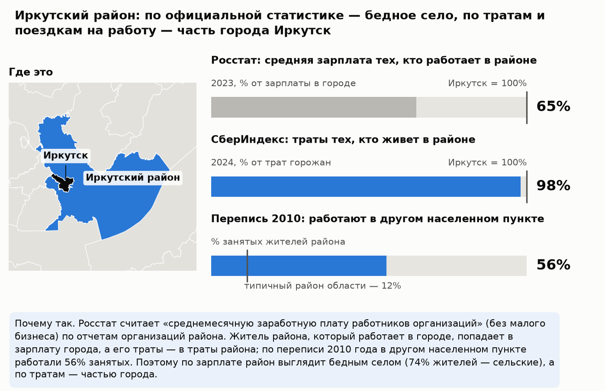
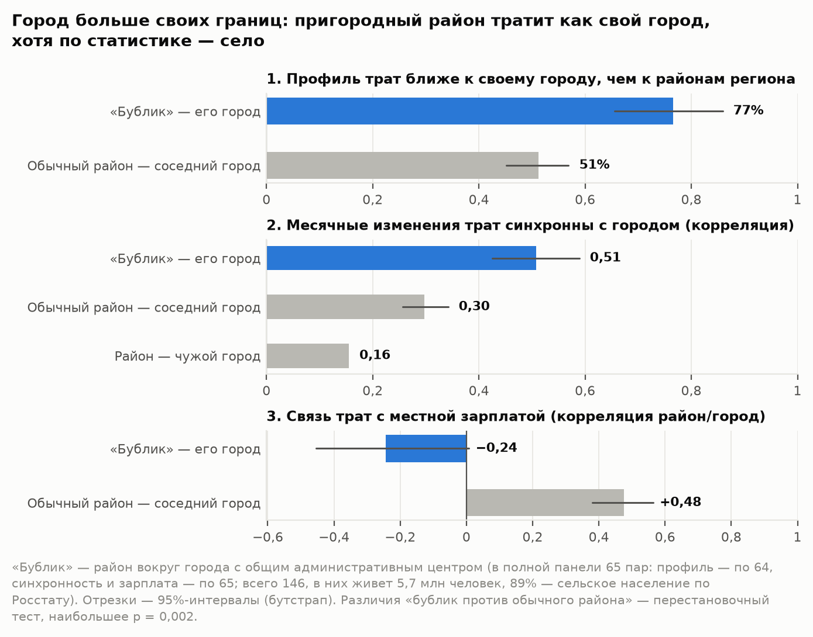
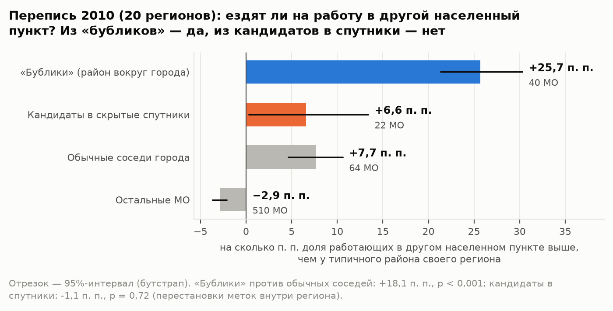
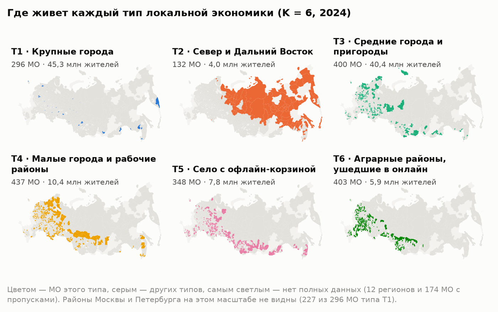
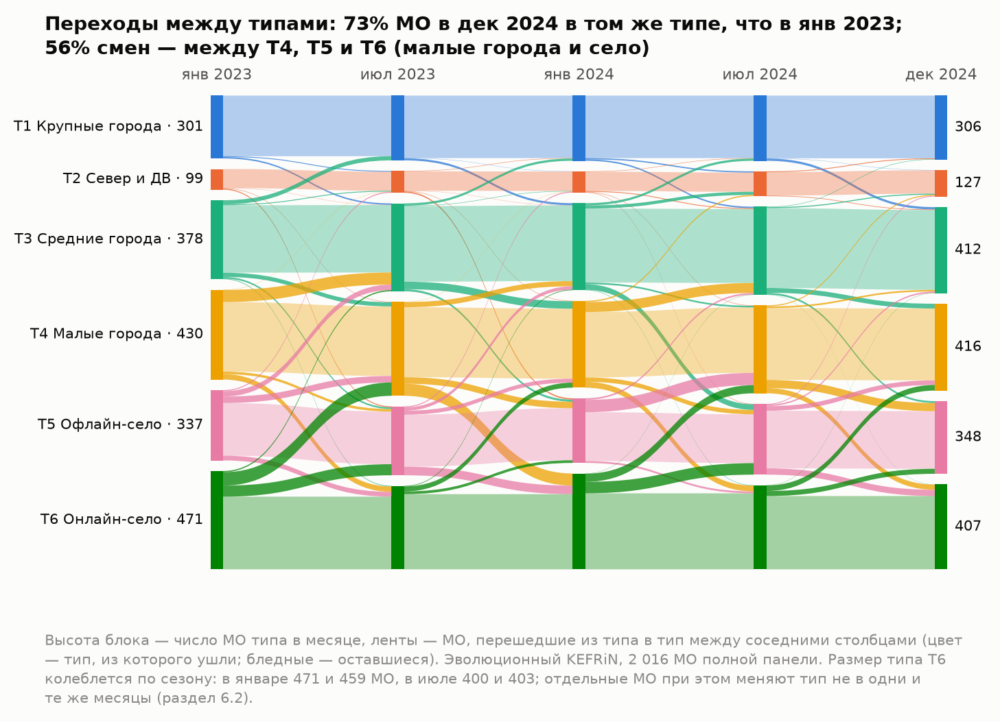

# Город больше своих границ

Типы локальных экономик России по тратам жителей: динамическая атрибутированная сеть муниципальных образований.
**Краткая версия методологического отчета.** Онлайн-конкурс СберИндекса 2026, номинация «Кластеризация». Автор: Дмитрий Юшков.

*Как читать.* Здесь главная линия работы на нескольких страницах. Все числа те же, что в полном отчете: оба собираются
из одних выходов пайплайна. Ссылки «раздел N» ведут в полный отчет — `report.pdf` рядом с этим файлом и на лендинге
<https://demondevils666.github.io/research-2026/>. Код, конфиги и инструкция по запуску — <https://github.com/demondevils666/research-2026>.

> **Коротко.**
> - **Что построено.** Сеть из 2 016 муниципальных образований (МО). Узел описан структурой и уровнем трат
>   жителей по данным СберИндекса за 24 месяца. Ребро соединяет соседей по границе, и вес ребра тем больше, чем
>   ближе их центры по дороге. Совместная кластеризация признаков и сети (KEFRiN) выделяет **6 типов местных
>   экономик**; число типов и вес сети выбраны согласованно, по воспроизводимости на подвыборках.
> - **Главная находка: город больше своих границ.** Ее можно проследить в три шага.
>   1. *Факт.* У 76% районов вокруг городов с общим административным центром («бубликов») профиль трат ближе
>      к своему городу, чем к районам своего региона (88 пар); у обычных соседних районов —
>      у 51%. При этом по Росстату 89% жителей «бубликов» — сельское население.
>      Сильнее всего это у столиц регионов: 20 «бубликов» из 20 против 42% у обычных соседей.
>      У остальных городов различие по профилю меньше и статистически незначимо (66% против 55%;
>      разбивка — по 64 парам полной панели),
>      но по переписи и оттуда чаще ездят на работу в другой населенный пункт (раздел 2.1).
>   2. *Механизм.* Росстат считает зарплату по месту работы (по организациям на территории МО), а СберИндекс траты —
>      по месту жительства. Если житель района работает в городе, его зарплата попадает в статистику города, а траты —
>      в статистику района. Перепись 2010 года это подтверждает: в «бубликах» доля работающих в другом населенном
>      пункте на 25,7 п. п. выше, чем у типичного района своего региона, у обычных соседей города — на
>      7,7 п. п. (20 регионов).
>   3. *Следствие.* Официальная статистика не видит пригородную экономику: по типу населенного пункта «бублики» — село,
>      а зарплата их жителей засчитывается городу, где они работают. Во всех 146 «бубликах» живут 5,7 млн человек. Реальные города больше официальных:
>      у 149 городов, где у пригорода есть данные о тратах, официально 32,7 млн жителей, а вместе с
>      «бубликами» — 36,2 млн. Для оценки благосостояния, программ поддержки и планирования агломераций
>      нужен взгляд по месту жительства — его дают траты.
> - **С отчетом лаборатории СберИндекса это согласуется.** Все 4 пригорода Дальнего Востока, которые она
>   назвала в своем отчете, попали в наши «городские» типы (T1, T3). Районов всего 4, и у 2 из них
>   города нет в данных, поэтому это сверка, а не строгая проверка.
> - **Вывод о методе.** Тип территории задает поведение жителей, а не соседство: при выбранном весе сети
>   α = 0,6 разбиение почти совпадает с разбиением только по тратам (ARI 0,97): сеть передвинула
>   лишь 28 МО из 2 016 — пограничных, а если вес сети в KEFRiN больше 0,6, типы перестают воспроизводиться. Это вывод для нашей постановки —
>   KEFRiN, сеть соседства, 6 типов на всю страну.

## Метод в шести шагах

| Шаг | Что делаем | Раздел |
|---|---|---|
| 1. Данные | 2 016 МО × 24 месяца безналичных трат жителей по шести категориям (СберИндекс). Росстат, перепись 2010 года и отчеты лаборатории в расчет типов не входят — ими типы только проверяются | 1.1 |
| 2. Признаки | CLR шести долей + ln(траты) − медиана месяца: структура трат и уровень относительно страны в том же месяце (без инфляции и сезона) | 1.2 |
| 3. Сеть | w = общая граница × e^(−км/τ), τ = 67,7 км: соседи по границе, чем ближе центры по дороге, тем сильнее связь; сеть не зависит от трат. Еще пять правил ребра — для сравнения | 1.3, 4.3 |
| 4. KEFRiN | Совместная кластеризация трат и сети: K = 6 — по воспроизводимости на подвыборках, вес сети α = 0,6 — той же проверкой | 4, прил. Б |
| 5. Динамика | Эволюционный KEFRiN по месяцам (β = 0,5) и схема MONIC: смены типа у МО, судьба типов целиком, содержание типов | 6 |
| 6. Качество и проверка | Шесть индексов конкурса, сравнение 8 методов на 10 seed, устойчивость, проверка Росстатом, переписью 2010 года и отчетом лаборатории | 3, 5, 8 |

## Три вопроса конкурса — короткие ответы

| Вопрос | Короткий ответ | Подробно |
|---|---|---|
| Что именно найдено? | Шесть типов местных экономик — от крупных городов до аграрных районов, где доля маркетплейсов выше всего. Пригороды тратят как свой город, хотя статистика считает их селом. Поведение важнее географии: сеть почти не меняет типы и не создает их. | разделы 2–4 |
| Почему этому можно доверять? | Проверка данными, которые в расчет не входили: Росстат и перепись 2010 года; с ними согласуется отчет лаборатории. Тип сравниваем с простой базой — группами по одному уровню трат. Отрицательные результаты показаны: налоговый след пригородов, скрытые спутники по переписи, незначимые различия методов. Прогон воспроизводится байт в байт. | разделы 2, 3.2, 5.4, 8, 11 |
| Как это использовать дальше? | Сверять зарплату Росстата с тратами СберИндекса, чтобы не принять пригород за бедное село; сравнивать МО с похожими из других регионов («двойниками»): искать у них применимый опыт и сравнивать рост трат. | раздел 9 |

*Рис. 1. Пример главной находки: Иркутский район по данным Росстата, СберИндекса и переписи 2010 года.
По тратам район относится к тому же типу, что и его город (T1).*

## 1. Главная находка: «бублики» по тратам ближе к своему городу

**«Бублик»** — район вокруг города с общим административным центром (Иркутский район вокруг Иркутска). **Контроль** —
обычные районы, которые тоже граничат с городским округом своего региона. Если район похож на город только потому,
что граничит с ним, контроль покажет то же самое.

| Измерение | «Бублик» — свой город | Обычный район — соседний город | Тест |
|---|---|---|---|
| Профиль трат ближе к своему городу, чем к районам своего региона (все пары с данными: 88 «бубликов», 283 — контроля) | **76%** (ДИ 67–84%) | 51% | p < 0,001 |
| Синхронность помесячных изменений трат с городом (средняя корреляция; полная панель: 65 и 286 пар) | **0,51** | 0,30; с чужим городом: 0,16 | p < 0,001 |
| Траты идут за местной зарплатой Росстата? (корреляция отношений район/город) | **−0,24**: связи нет | 0,48 | p < 0,001 |

- **Сильнее всего у столиц регионов:** 20 «бубликов» из 20 против 42% у обычных соседей. У остальных
  городов — 66% против 55%, различие незначимо (разбивка — по 64 парам полной панели).
- **Механизм** — место работы против места жительства: Росстат считает зарплату по организациям на территории МО,
  СберИндекс — траты жителей. Перепись 2010 года, которая в расчет не входила, это подтверждает: из «бубликов» ездят
  на работу в другой населенный пункт на 25,7 п. п. чаще типичного района своего региона, из обычных соседей
  города — на 7,7 п. п. (разница проверена внутри регионов, p < 0,001; 20 регионов).
- **p-значения — ориентир.** Пары с общим городом не независимы (286 пар контроля приходятся на 153 города),
  поэтому p-значения тестов по парам, вероятно, занижены.

*Рис. 2. Три меры: «бублик» против обычного соседнего района (полная панель). В полном отчете — рис. 2.*

*Рис. 3. Перепись 2010 года: доля работающих в другом населенном пункте по группам МО. В полном отчете — рис. 3.*

## 2. Шесть типов местных экономик

| Тип | МО | Жителей, млн | Траты, ₽/мес. (медиана) | Чем отличается от средней России |
|---|---|---|---|---|
| **T1 Крупные города** | 296 | 45,3 | 49 926 | общепит +128%, траты +65%, транспорт +29% |
| **T2 Север и Дальний Восток** | 132 | 4,0 | 39 394 | маркетплейсы −34%, траты +31%, прочее +25% |
| **T3 Средние города и пригороды** | 400 | 40,4 | 32 723 | общепит +37%, транспорт +14%, траты +9% |
| **T4 Малые города и рабочие районы** | 437 | 10,4 | 24 850 | общепит −36%, транспорт −26%, траты −17% |
| **T5 Село с офлайн-корзиной** | 348 | 7,8 | 23 786 | общепит −39%, траты −23%, транспорт +10% |
| **T6 Аграрные районы, ушедшие в онлайн** | 403 | 5,9 | 21 861 | общепит −63%, траты −28%, прочее −23% |

- **T1 — прежде всего Москва и Петербург:** 227 из 296 МО типа — их внутригородские территории.
- **Проверка показателями, которые в расчет не входили** (8 Росстата и 2 индекса СберИндекса). Против простой базы — столько же групп по одному уровню трат —
  тип надежно сильнее по 4 показателям (население, занятость в добыче, занятость в рыночных услугах, доступность рынков), на уровне базы — по 4,
  слабее — по 2 (зарплата, занятость в бюджетном секторе): «надежно» — 95%-интервал разницы η² выше нуля (раздел 3.2).
  Так и должно быть: уровень трат — почти доход, и доход он объясняет сам; тип добавляет размер, положение и отрасли.
- Каждый тип описывается правилом из 1–3 условий; средний F1 на отложенных МО — 0,79 (раздел 3.4).

*Рис. 4. Где лежит каждый тип. В полном отчете — рис. 5.*

## 3. Методы и шесть индексов конкурса

| Метод | SW ↑ | CH ↑ | S_Dbw ↓ | AVI ↑ | AVU ↓ | MQ ↑ | Ср. ранг (10 seed) |
|---|---|---|---|---|---|---|---|
| **KEFRiN, физическая сеть** | 0,221 | 675 | 0,63 | 0,559 | 0,472 | 0,386 | 2,50 |
| k-means | 0,220 | 675 | 0,72 | 0,535 | 0,472 | 0,371 | 3,33 |
| KEFRiN, сеть сходства | 0,220 | 670 | 0,63 | 0,542 | 0,475 | 0,385 | 3,33 |
| CANUS, физическая сеть | 0,238 | 646 | 0,66 | 0,553 | 0,466 | 0,341 | 4,67 |
| спектральная, граф сходства | 0,162 | 524 | 0,72 | 0,615 | 0,535 | 0,364 | 5,00 |
| GMM | 0,152 | 435 | 0,87 | 0,581 | 0,448 | 0,415 | 5,50 |
| Leiden, физическая сеть | −0,129 | 28 | 0,88 | 1,000 | 0,250 | 0,119 | 5,50 |
| Leiden, сеть сходства | 0,126 | 508 | 1,03 | 0,533 | 0,563 | 0,375 | 6,17 |

- SW, CH и S_Dbw считаются по тратам, AVI, AVU и MQ (модулярность Q) — по физической сети. Сетевые индексы сверены с
  библиотекой жюри Pattern, S_Dbw — с пакетом s-dbw.
- KEFRiN на физической сети первый по среднему рангу, но тест Фридмана различие методов не доказывает (p = 0,108):
  независимых блоков всего 6. Сравнение к тому же наклонено в пользу KEFRiN: его вес сети выбран по той же сети,
  на которой считаются AVI, AVU и MQ, а базовые методы не настраивались (раздел 5.4).
- Структура умеренная (силуэт 0,221): территории лежат на непрерывном спектре. Поэтому типы обосновываем
  устойчивостью и внешней проверкой, а не порогом индекса (разделы 5.3, 8).
- **Вес сети.** α = 0,6 выбран правилом: максимум связности в сети при почти той же компактности по тратам и той же
  устойчивости, что при выборе K. При нем разбиение почти совпадает с разбиением только по тратам (ARI 0,97):
  сеть передвинула лишь 28 МО из 2 016 — пограничных, у которых доля связей с соседями своего типа выросла
  с 9% до 63%. Типы раскиданы по всей стране, а сеть знает только соседей, поэтому двигать может лишь
  МО на границе типов: тип задают траты жителей, а не соседство (раздел 4).

## 4. Динамика

Эволюционный KEFRiN (β = 0,5) меняет тип у 6,2% МО в месяц, независимая кластеризация каждого месяца —
у 20,4%. В декабре 2024 в том же типе, что в январе 2023, 73% МО; из 554 сменивших тип
56% переходят между T4, T5 и T6 — малыми городами и селом. По схеме MONIC все 6 типов «выживают»
каждый месяц; при сглаживании и фиксированном K это ожидаемо, поэтому MONIC здесь — проверка согласованности (раздел 6).

*Рис. 5. Переходы между типами за два года. В полном отчете — рис. 10.*

## 5. Главные ограничения

Пять главных; полный список — с тем, почему каждое важно и что мы сделали, — в разделе 10 полного отчета.

1. **Эффект «бубликов» — в основном у столиц регионов.** У остальных городов различие по профилю трат незначимо;
   механизм у них виден только по переписи (раздел 2.1).
2. **Перепись 2010 года старше трат на 13–14 лет.** Поздние пригороды в ней не видны; кандидатов в скрытые
   спутники она не подтвердила, поэтому они остаются кандидатами (раздел 2.2).
3. **Пары не независимы.** Тесты по парам — ориентир; перепись проверена перестановками внутри регионов (раздел 10, п. 13).
4. **Превосходство метода не доказано.** KEFRiN выбран за устройство (траты и сеть в одной модели) и устойчивость,
   а не за место в рейтинге (раздел 5.4).
5. **Траты — модельная оценка СберИндекса.** Наличные и другие банки не видны; для «бубликов» модель «домашней
   локации» может частично смешивать жителей района и города (раздел 10, п. 1).

## 6. Воспроизводимость

Параметры — `configs/*.yaml`, seed 42, данные сверяются с `data/raw/MANIFEST.json` по sha256. Все пересобирается
скриптом `scripts/run_all.py` байт в байт, кроме времени счета и даты PDF; команды запуска — в README и разделе 11.